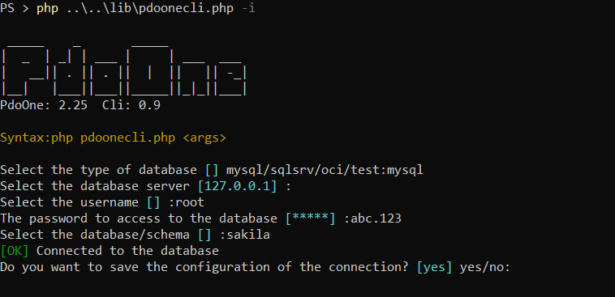
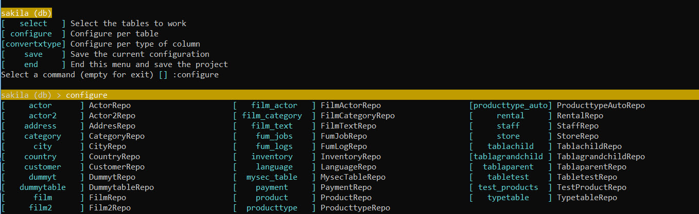

# Database Access Object wrapper for PHP and PDO in a single class

PdoOne. It's a simple wrapper for PHP's PDO library compatible with SQL Server (2008 R2 or higher), MySQL (5.7 or higher) and Oracle (12.1 or higher).

This library tries to **work as fast as possible**. Most of the operations are simple string/array managements and work in the bare metal of the PDO library, but it also allows to create an ORM.

[](https://packagist.org/packages/eftec/PdoOne)
[](https://packagist.org/packages/eftec/PdoOne)
[]()
[]()
[]()
[]()
[]()

Turn this

```php
$stmt = $pdo->prepare("SELECT * FROM myTable WHERE name = ?");
$stmt->bindParam(1,$_POST['name'],PDO::PARAM_STR);
$stmt->execute();
$result = $stmt->get_result();
$products=[];
while($row = $result->fetch_assoc()) {
  $product[]=$row; 
}
$stmt->close();
```

into this

```php
$products=$pdoOne
    ->select("*")
    ->from("myTable")
    ->where("name = ?",[$_POST['name']]) 
    ->toList();
```

or using the ORM.

```php
ProductRepo // this class was generated with echo $pdoOne()->generateCodeClass(['Product']); or using the cli.
    ::where("name = ?",[$_POST['name']])
    ::toList();
```

# Table of contents

- [Database Access Object wrapper for PHP and PDO in a single class](#database-access-object-wrapper-for-php-and-pdo-in-a-single-class)
  - [Examples](#examples)
  - [Installation](#installation)
    - [Install (using composer)](#install-using-composer)
    - [Install (manually)](#install-manually)
  - [How to create a Connection?](#how-to-create-a-connection)
    - [OCI](#oci)
  - [How to run a SQL command?](#how-to-run-a-sql-command)
    - [1. Running a raw query](#1-running-a-raw-query)
    - [2. Running a native PDO statement](#2-running-a-native-pdo-statement)
    - [3. Running using the query builder](#3-running-using-the-query-builder)
    - [4. Running using a ORM](#4-running-using-a-orm)
  - [How to work with Date values?](#how-to-work-with-date-values)
  - [How to run a transaction?](#how-to-run-a-transaction)
  - [Custom Queries](#custom-queries)
    - [tableExist($tableName)](#tableexisttablename)
    - [statValue($tableName,$columnName)](#statvaluetablenamecolumnname)
    - [columnTable($tablename)](#columntabletablename)
    - [foreignKeyTable($tableName)](#foreignkeytabletablename)
    - [createTable($tableName,$definition,$primaryKey=null,$extra='',$extraOutside='')](#createtabletablenamedefinitionprimarykeynullextraextraoutside)
    - [tableSorted($maxLoop = 5, $returnProblems = false, $debugTrace = false)](#tablesortedmaxloop--5-returnproblems--false-debugtrace--false)
    - [validateDefTable($pdoInstance,$tablename,$defTable,$defTableKey)](#validatedeftablepdoinstancetablenamedeftabledeftablekey)
    - [foreignKeyTable](#foreignkeytable)
  - [Query Builder (DQL)](#query-builder-dql)
    - [select($columns)](#selectcolumns)
    - [count($sql,$arg='*')](#countsqlarg)
    - [min($sql,$arg='*')](#minsqlarg)
    - [max($sql,$arg='*')](#maxsqlarg)
    - [sum($sql,$arg='*')](#sumsqlarg)
    - [avg($sql,$arg='*')](#avgsqlarg)
    - [distinct($distinct='distinct')](#distinctdistinctdistinct)
    - [from($tables)](#fromtables)
    - [where($where,[$arrayParameters=array()])](#wherewherearrayparametersarray)
      - [Where() without parameters.](#where-without-parameters)
      - [Where() with parameters defined by a indexed array.](#where-with-parameters-defined-by-a-indexed-array)
      - [Where() using an associative array](#where-using-an-associative-array)
      - [Where() using an associative array and named arguments](#where-using-an-associative-array-and-named-arguments)
      - [Examples of where()](#examples-of-where)
    - [order($order)](#orderorder)
    - [group($group)](#groupgroup)
    - [having($having,[$arrayParameters])](#havinghavingarrayparameters)
    - [End of the chain](#end-of-the-chain)
      - [runGen($returnArray=true)](#rungenreturnarraytrue)
      - [toList($pdoMode)](#tolistpdomode)
      - [toMeta()](#tometa)
      - [toListSimple()](#tolistsimple)
      - [toListKeyValue()](#tolistkeyvalue)
      - [toResult()](#toresult)
      - [firstScalar($colName=null)](#firstscalarcolnamenull)
      - [first()](#first)
      - [last()](#last)
      - [sqlGen()](#sqlgen)
  - [Query Builder (DML)](#query-builder-dml)
    - [insert($table,$schema,[$values])](#inserttableschemavalues)
    - [insertObject($table,[$declarativeArray],$excludeColumn=[])](#insertobjecttabledeclarativearrayexcludecolumn)
    - [update($$table,$schema,$values,[$schemaWhere],[$valuesWhere])](#updatetableschemavaluesschemawherevalueswhere)
    - [delete([$table],[$schemaWhere],[$valuesWhere])](#deletetableschemawherevalueswhere)
  - [Cache](#cache)
    - [How to configure it?](#how-to-configure-it)
    - [Example using apcu](#example-using-apcu)
  - [Sequence](#sequence)
    - [Creating a sequence](#creating-a-sequence)
    - [Creating a sequence without a table.](#creating-a-sequence-without-a-table)
    - [Using the sequence](#using-the-sequence)
  - [Fields](#fields)
  - [Encryption](#encryption)
  - [How to debug and trace errors in the database?](#how-to-debug-and-trace-errors-in-the-database)
    - [Setting the log level](#setting-the-log-level)
    - [Throwing errors](#throwing-errors)
    - [Getting the last Query](#getting-the-last-query)
    - [Generating a log file](#generating-a-log-file)
  - [CLI](#cli)
    - [Run as cli](#run-as-cli)
    - [Run as CLI interative](#run-as-cli-interative)
      - [Examples](#examples)
    - [Run CLI to generate repository classes.](#run-cli-to-generate-repository-classes)
    - [cli-classcode](#cli-classcode)
    - [cli-selectcode](#cli-selectcode)
    - [cli-arraycode](#cli-arraycode)
    - [cli-json](#cli-json)
    - [cli-csv](#cli-csv)
    - [UI](#ui)
    - [How to run the UI?](#how-to-run-the-ui)
  - [ORM](#orm)
    - [What is an ORM?](#what-is-an-orm)
    - [Building and installing the ORM](#building-and-installing-the-orm)
      - [Creating the repository class](#creating-the-repository-class)
      - [Creating multiples repositories classes](#creating-multiples-repositories-classes)
      - [Creating all repositories classes](#creating-all-repositories-classes)
    - [Using the Repository class.](#using-the-repository-class)
      - [Using multiples connections](#using-multiples-connections)
    - [DDL  Database Design Language](#ddl--database-design-language)
    - [Nested Operators](#nested-operators)
    - [DQL Database Query Language](#dql-database-query-language)
    - [DML Database Model Language](#dml-database-model-language)
    - [Validate the model](#validate-the-model)
    - [Recursive](#recursive)
      - [recursive()](#recursive)
      - [getRecursive()](#getrecursive)
      - [hasRecursive()](#hasrecursive)
  - [Benchmark (mysql, estimated)](#benchmark-mysql-estimated)
  - [Error FAQs](#error-faqs)
    - [Uncaught Error: Undefined constant eftec\_BasePdoOneRepo::COMPILEDVERSION](#uncaught-error-undefined-constant-eftec_basepdoonerepocompiledversion)
  - [Changelist](#changelist)


## Examples


| [ExampleTicketPHP](https://github.com/jorgecc/ExampleTicketPHP)                                                                                                                                                                                                        | [Example cupcakes](https://github.com/EFTEC/example.cupcakes)                                                                     | [Example Search](https://github.com/EFTEC/example-search)                                                                              | [Example Different Method](https://github.com/escuelainformatica/example-pdoone)                          |
|------------------------------------------------------------------------------------------------------------------------------------------------------------------------------------------------------------------------------------------------------------------------|-----------------------------------------------------------------------------------------------------------------------------------|----------------------------------------------------------------------------------------------------------------------------------------|-----------------------------------------------------------------------------------------------------------|
|  |  |  |  |

More examples:

[Example Mysql PHP and PDO using PDOOne](https://www.southprojects.com/Programming/mysql-php-pdo)

## Installation

This library requires PHP 7.1 and higher, and it requires the extension PDO and the extension PDO-MYSQL (Mysql), PDO-SQLSRV (sql server) or PDO-OCI (Oracle)

### Install (using composer)

Edit  **composer.json** the next requirement, then update composer.

```json
  {
      "require": {
        "eftec/PdoOne": "^2.0"
      }
  }
```
or install it via cli using

> composer require eftec/PdoOne

### Install (manually)

Just download the folder lib from the library and put in your folder project.  Then you must include all the files included on it.

## How to create a Connection?

Create an instance of the class PdoOne as follows. Then, you can open the connection using the method connect() or open()

```php
use eftec\PdoOne;
// mysql
$dao=new PdoOne("mysql","127.0.0.1","root","abc.123","sakila","");
$conn->logLevel=3; // it is for debug purpose and it works to find problems.
$dao->connect();

// sql server 10.0.0.1\instance or (local)\instance or machinename\instance or machine (default instance)
$dao=new PdoOne("sqlsrv","(local)\sqlexpress","sa","abc.123","sakila","");
$conn->logLevel=3; // it is for debug purpose and it works to find problems.
$dao->connect();

// test (mockup)
$dao=new PdoOne("test","anyy","any","any","any","");
$dao->connect();

// oci (oracle) ez-connect

$cs='(DESCRIPTION =(ADDRESS = (PROTOCOL = TCP)(HOST = localhost)(PORT = 1521))(CONNECT_DATA =(SERVER = DEDICATED)(SERVICE_NAME = instancia1)))';
$dao=new PdoOne("oci",$cs,"sa","abc.123"); // oracle uses the user as the schema
$conn->logLevel=3; // it is for debug purpose and it works to find problems.
$dao->connect();

// oci (oracle) tsnnames (the environment variables TNS_ADMIN and PATH must be correctly configured), also tnsnames.ora must exists.
$cs='instancia1';
$dao=new PdoOne("oci",$cs,"sa","abc.123"); // oracle uses the user as the schema
$conn->logLevel=3; // it is for debug purpose and it works to find problems.
$dao->connect();

```

where

> $dao=new PdoOne("mysql","127.0.0.1","root","abc.123","sakila","");

* "**mysql**" is the MySQL database. It also allows sqlsrv (for sql server) or "oci"
* **127.0.0.1** is the server where is the database.
* **root** is the user
* **abc.123** is the password of the user root.
* **sakila** is the database used.
* "" (optional) it could be a log file, such as c:\temp\log.txt

### OCI
Oracle is tricky to install. In Windows, from the Oracle home's bin folder, you must copy all the dll
to the PHP folder and Apache Folder.


## How to run a SQL command?

### 1. Running a raw query

With the method **RunRawQuery()**, we could execute a command directly to PDO with or without parameters. And it could return a **PdoStatement** or an **array**. It is useful when we want speed.

> **RunRawQuery($rawSql,$param,$returnArray)**
>
> string **$rawSql** The query to execute
> array|null **$param** [type1,value1,type2,value2] or [name1=>value,name2=value2]
> bool **$returnArray** if true (default) then it returns an array. If false then it returns a **PDOStatement**

```php
$sql='select * from table where id=1';
$pdoStatement=$pdoOne->runRawQuery($sql,[],false);  // [] are the parameters
```

But we could change it to returns an array

```php
$sql='select * from table where id=1';
$values=$pdoOne->runRawQuery($sql);  // [] are the parameters
```

We could also pass parameters.

```php
$values=$con->runRawQuery('select * from table where id=?',[20]); // with parameter
$values=$con->runRawQuery('select * from table where id=:name',['name'=>20]); // with named parameter
$values=$con->runRawQuery('select * from table',[]); // without parameter.

```

> Note, this library uses prepared statements, so it is free of SQL injection (if you use parameters)

```php
$name="O'hara";
$values=$con->runRawQuery("select * from table where name=:name",['name'=> $name]); // it works.✅
$values=$con->runRawQuery("select * from table where name=?",[$name]); // it works ok.✅
$values=$con->runRawQuery("select * from table where name='$name'"); // it will crash.❌
```


### 2. Running a native PDO statement

With the method **runQuery()** we could execute a prepared statement in PDO. It is useful when we want to pass arguments to it.   **runQuery()** requires a PDO **PreparedStatement**.

> This method is not recommended unless you are already working with PDO statements and you don't want to adapt all your code.

```php
$sql="insert into `product`(name) values(?)";
$stmt=$pdoOne->prepare($sql);
$productName="Cocacola";
$stmt->bind_param("s",$productName); // s stand for a string. Also i =integer, d = double and b=blob
$rows=$pdoOne->runQuery($stmt);
$allRows=$rows->fetch_all(PDO::FETCH_ASSOC);
```

### 3. Running using the query builder

You can use the query builder to build your command.  You could check the chapter about [Query Builder (DQL)](#query-builder--dql-) for more information.

```php
// query builder
$pdoOne->set(['name'=>'cocacola'])
    ->from('product')
    ->insert();

```

### 4. Running using a ORM

This library also allows to create an **[orm]**(#orm) of your tables. If you are generated an ORM, then you can use the next code

```php
ProductRepo::toList(['category'=>'drink']);
```

Where **ProductRepo** is a service class generated by using the ORM.


## How to work with Date values?

PdoOne allows 5 types of dates.

* **SQL Format** It is the format how the date is stored into the database. It depends on the type of the database. For example MySQL could uses the format Y-m-d.

* **Human Format**  It is the format how the end user looks our date.

* **ISO Date Format**. It is the format how the value could be transported and serialized.

* **Timestamp**: It counts the number of seconds after 1-1-1970

* **Class / PHP Class**: It is an **DateTime** object.

  

## How to run a transaction?

There are 3 methods to runs a transaction:

| Method             | Description                                                                           |
|--------------------|---------------------------------------------------------------------------------------|
| startTransaction() | It starts a transaction. Depending on the type database, it could be stacked  or not. |
| commit()           | Commit (and closes) a transaction                                                     |
| rollback()         | Rollback (and closes) a transaction                                                   |

Example:

```php
try {
    $sql="insert into `product`(name) values(?)";
    $pdoOne->startTransaction();
    $result=$pdoOne->runRawQuery($sql,['Fanta'=>$productName],false);
    $pdoOne->commit(); // transaction ok
} catch (Exception $e) {
    $pdoOne->rollback(false); // error, transaction cancelled, the false means that it doesn't throw an exception if we want rollback.
}
```


## Custom Queries

### tableExist($tableName)

Returns true if the table exists (current database/schema)

### statValue($tableName,$columnName)

Returns the statistics (as an array) of a column of a table.

```php
$stats=$pdoOne->statValue('actor','actor_id');
```

| min | max | avg      | sum   | count |
|-----|-----|----------|-------|-------|
| 1   | 205 | 103.0000 | 21115 | 205   |

### columnTable($tablename)

Returns all columns of a table

```php
$result=$pdoOne->columnTable('actor');
```

| colname     | coltype   | colsize | colpres | colscale | iskey | isidentity |
|-------------|-----------|---------|---------|----------|-------|------------|
| actor_id    | smallint  |         | 5       | 0        | 1     | 1          |
| first_name  | varchar   | 45      |         |          | 0     | 0          |
| last_name   | varchar   | 45      |         |          | 0     | 0          |
| last_update | timestamp |         |         |          | 0     | 0          |

### foreignKeyTable($tableName)

Returns all foreign keys of a table (source table)

### createTable($tableName,$definition,$primaryKey=null,$extra='',$extraOutside='')

Creates a table using a definition and primary key.

* **$definition** The definition is an associative array with the name of the column as key and the definition as value.
* **primaryKey** It could be a string or associative array.
  * if it is a string then it is the name of the primary key, example "user_id";
  * if it is an associative array, then it could be used to define primary key, unique, key and foreign keys:
    * 'key_name'=>'PRIMARY KEY'
    * 'key_name'=>'KEY'
    * 'key_name'=>'UNIQUE KEY'
    * 'key_name'=>'FOREIGN KEY REFERENCES TABLEREF(COLREF) ...'
* **$extra** It defines an extra definition inside the definition of the table.
* **extraOutside** It defines an extra definition after the definition of the table.

>Note: You could generate a code to create a table using an existing table by executing cli (output classcode)   
> php pdoone.php -database mysql -server 127.0.0.1 -user root -pwd abc.123 -db sakila -input film -output classcode

Example: (mysql)

```php
$pdo->createTable('film',                                                                                                
    [                                                                                                                    
        "film_id" => "smallint unsigned not null auto_increment",                                                        
        "title" => "varchar(255) not null",                                                                              
        "description" => "text",                                                                                         
        "release_year" => "year",                                                                                        
        "language_id" => "tinyint unsigned not null",                                                                    
        "original_language_id" => "tinyint unsigned",                                                                    
        "rental_duration" => "tinyint unsigned not null default '3'",                                                    
        "rental_rate" => "decimal(4,2) not null default '4.99'",                                                         
        "length" => "smallint unsigned",                                                                                 
        "replacement_cost" => "decimal(5,2) not null default '19.99'",                                                   
        "rating" => "enum('G','PG','PG-13','R','NC-17') default 'G'",                                                    
        "special_features" => "set('Trailers','Commentaries','Deleted Scenes','Behind the Scenes')",                     
        "last_update" => "timestamp not null default CURRENT_TIMESTAMP on update CURRENT_TIMESTAMP"                      
    ],[                                                                                                                  
        "film_id" => "PRIMARY KEY",                                                                                      
        "title" => "KEY",                                                                                                
        "language_id" => "FOREIGN KEY REFERENCES`language`(`language_id`) ON UPDATE CASCADE",                            
        "original_language_id" => "FOREIGN KEY REFERENCES`language`(`language_id`) ON UPDATE CASCADE"                    
    ]);                                                                                                                  
```

```php
$pdo->createTable('film',                                                                                                
    [                                                                                                                    
        "film_id" => "smallint unsigned not null auto_increment",                                                        
        "title" => "varchar(255) not null",                                                                              
        "description" => "text",                                                                                         
        "release_year" => "year",                                                                                        
        "language_id" => "tinyint unsigned not null",                                                                    
        "original_language_id" => "tinyint unsigned",                                                                    
        "rental_duration" => "tinyint unsigned not null default '3'",                                                    
        "rental_rate" => "decimal(4,2) not null default '4.99'",                                                         
        "length" => "smallint unsigned",                                                                                 
        "replacement_cost" => "decimal(5,2) not null default '19.99'",                                                   
        "rating" => "enum('G','PG','PG-13','R','NC-17') default 'G'",                                                    
        "special_features" => "set('Trailers','Commentaries','Deleted Scenes','Behind the Scenes')",                     
        "last_update" => "timestamp not null default CURRENT_TIMESTAMP on update CURRENT_TIMESTAMP"                      
    ],'film_id');                                                                                                                  
```

Example (sqlsrv)


```php
$pdo->createTable('film',
   [
       "film_id" => "int NOT NULL IDENTITY(1,1)",
       "title" => "varchar(255) NOT NULL",
       "description" => "text(2147483647) DEFAULT (NULL)",
       "release_year" => "varchar(4)",
       "language_id" => "tinyint NOT NULL",
       "original_language_id" => "tinyint DEFAULT (NULL)",
       "rental_duration" => "tinyint NOT NULL DEFAULT ((3))",
       "rental_rate" => "decimal(4,2) NOT NULL DEFAULT ((4.99))",
       "length" => "smallint DEFAULT (NULL)",
       "replacement_cost" => "decimal(5,2) NOT NULL DEFAULT ((19.99))",
       "rating" => "varchar(10) DEFAULT ('G')",
       "special_features" => "varchar(255) DEFAULT (NULL)",
       "last_update" => "datetime NOT NULL DEFAULT (getdate())"
   ],[
       "language_id" => "FOREIGN KEY REFERENCES language(language_id)",
       "original_language_id" => "FOREIGN KEY REFERENCES language(language_id)",
       "film_id" => "PRIMARY KEY"
   ]);
```

### tableSorted($maxLoop = 5, $returnProblems = false, $debugTrace = false)

It returns a list of tables ordered by dependency (from no dependent to more dependent)

**Note**: This operation is not foolproof because the tables could have circular references.

```php
$dao = new PdoOne('sqlsrv', "(local)\sqlexpress", "sa", "abc.123", "sakila");
$dao->open();
echo "<pre>";
var_dump($dao->tableSorted(3, false, true)); // it returns the tables sortered
var_dump($dao->tableSorted(3, true, true)); // it returns all the tables that can't be sortered
echo "</pre>";
```


### validateDefTable($pdoInstance,$tablename,$defTable,$defTableKey)

It validates a table if the table matches the definition asigned by values.

```
$def=[
       "film_id" => "int NOT NULL IDENTITY(1,1)",
       "title" => "varchar(255) NOT NULL",
       "description" => "text(2147483647) DEFAULT (NULL)",
       "release_year" => "varchar(4)",
       "language_id" => "tinyint NOT NULL",
       "original_language_id" => "tinyint DEFAULT (NULL)",
       "rental_duration" => "tinyint NOT NULL DEFAULT ((3))",
       "rental_rate" => "decimal(4,2) NOT NULL DEFAULT ((4.99))",
       "length" => "smallint DEFAULT (NULL)",
       "replacement_cost" => "decimal(5,2) NOT NULL DEFAULT ((19.99))",
       "rating" => "varchar(10) DEFAULT ('G')",
       "special_features" => "varchar(255) DEFAULT (NULL)",
       "last_update" => "datetime NOT NULL DEFAULT (getdate())"
   ];
$keys=[
       "language_id" => "FOREIGN KEY REFERENCES language(language_id)",
       "original_language_id" => "FOREIGN KEY REFERENCES language(language_id)",
       "film_id" => "PRIMARY KEY"
   ]; 
   
var_dump(PdoOne::validateDefTable(self::getPdoOne(),self::TABLE,$def,$keys));
```


### foreignKeyTable

It returns all the foreign keys of a table.


```php

$result=$pdoOne->foreignKeyTable('actor');
```

| collocal    | tablerem | colrem      |
|-------------|----------|-------------|
| customer_id | customer | customer_id |
| rental_id   | rental   | rental_id   |
| staff_id    | staff    | staff_id    |


## Query Builder (DQL)
You could also build a procedural query.

Example:
```php
$results = $pdoOne->select("*")->from("producttype")
    ->where('name=?', [ 'Cocacola'])
    ->where('idproducttype=?', [ 1])
    ->toList();   
```

### select($columns)
Indicates the columns to return. The argument is a SQL command, so it allows any operation that the database support, including functions, constants, operators, alias and such.
```php
$results = $pdoOne->select("col1,col2"); //...
```
> Generates the query: **select col1,col2** ....

```php
$results = $pdoOne->select("select * from table"); //->...
```

> Generates the query: **select * from table** ....

### count($sql,$arg='*')

Generates a query that returns a count of values.
It is a macro of the method select()

```php
$result = $pdoOne->count('from table where condition=1'); // select count(*) from table where c..
$result = $pdoOne->count()->from('table')->where('condition=?',[1]); // select count(*) from table where c..
$result = $pdoOne->count('from table','col1'); // select count(col1) from table
$result = $pdoOne->count()->from('table'); // select count(*) from table
```

### min($sql,$arg='*')

Generates a query that returns the minimum value of a column.
If $arg is empty then it uses $sql for the name of the column
It is a macro of the method select()

```php
$result = $pdoOne->min('from table where condition=1','col'); // select min(col) from table where c..
$result = $pdoOne->min('from table','col1'); // select min(col1) from table
$result = $pdoOne->min('','col1')->from('table'); // select min(col1) from table
$result = $pdoOne->min('col1')->from('table'); // select min(col1) from table
```

### max($sql,$arg='*')

Generates a query that returns the maximum value of a column.
If $arg is empty then it uses $sql for the name of the column
It is a macro of the method select()

```php
$result = $pdoOne->max('from table where condition=1','col'); // select max(col) from table where c..
$result = $pdoOne->max('from table','col1'); // select max(col1) from table
```

### sum($sql,$arg='*')

Generates a query that returns the sum value of a column.
If $arg is empty then it uses $sql for the name of the column
It is a macro of the method select()

```php
$result = $pdoOne->sum('from table where condition=1','col'); // select sum(col) from table where c..
$result = $pdoOne->sum('from table','col1'); // select sum(col1) from table
```

### avg($sql,$arg='*')

Generates a query that returns the average value of a column.
If $arg is empty then it uses $sql for the name of the column
It is a macro of the method select()

```php
$result = $pdoOne->avg('from table where condition=1','col'); // select avg(col) from table where c..
$result = $pdoOne->avg('from table','col1'); // select avg(col1) from table
```

### distinct($distinct='distinct')
Generates a select command.
```php
$results = $pdoOne->select("col1,col2")->distinct(); //...
```
> Generates the query: select **distinct** col1,col2 ....

>Note: ->distinct('unique') returns select **unique** ..

### from($tables)
Generates a "from" sql command.
```php
$results = $pdoOne->select("*")->from('table'); //...
```
> Generates the query: select * **from table**

**$tables** could be a single table or a sql construction. For examp, the next command is valid:

```php
$results = $pdoOne->select("*")->from('table t1 inner join t2 on t1.c1=t2.c2'); //...
```

### where($where,[$arrayParameters=array()])

Generates a where command.

* $where is an array or a string. If it's a string, then it's evaluated by using the parameters. if any

```php
$results = $pdoOne->select("*")
->from('table')
->where('p1=1'); //...
```

The where could be expressed in different ways.

#### Where() without parameters.

It is possible to write the where without parameters as follow:

```php
$results = $pdoOne->select("*")->from('table')->where("p1=1 and p2>2.5 or p3 like '%aa%'");
```

#### Where() with parameters defined by a indexed array.

```php
$aa='aa';
$results = $pdoOne->select("*")->from('table')->where("p1=? and p2>? or p3 like ?",[1
                                                                                    ,2.5
                                                                                    ,"%$aa%"]);
```

It also works

```php
// (if there is only a single argument without a type)
$results = $pdoOne->select("*")->from('table')->where("p1=?",[1]);  // = where("p1=?",[1]);
// (if we don't define to where to put the value)
$results = $pdoOne->select("*")->from('table')->where("p1",[1]); // = where("p1=?",[1]);
```


#### Where() using an associative array

It is a shorthand definition of a query using an associative array, where the key is the name of the column and the value is the value to compare

It only works with **equality** (=) and the logic operator **'and'**  (the type is defined automatically)

```php
// select * from table where p1='1' and p2='2.5' and p3='aa'
$results = $pdoOne->select("*")->from('table')->where(['p1'=>1
                                                       ,'p2'=>2.5
                                                       ,'p3'=>'aa']);  
```

Also it is possible to specify the type of parameter.

```php
// select * from table where p1=1 and p2='2.5' and p3='aa'
$results = $pdoOne->select("*")->from('table')->where(['p1'=>[1]
                                                       ,'p2'=>[2.5]
                                                       ,'p3'=>['aa']]);  
```

#### Where() using an associative array and named arguments

You could also use an associative array as argument and named parameters in the query

```php
$results = $pdoOne->select("*")->from("table")
    ->where('condition=:p1 and condition2=:p2',['p1'=>'Coca-Cola','p2'=>1])
    ->toList();
```

> Generates the query: select * from table **where condition=?(Coca-Cola) and condition2=?(1)**

#### Examples of where()

> Generates the query: select * **from table** where p1=1

> Note: ArrayParameters is an array as follow: **type,value.**     
>   Where type is i=integer, d=double, s=string or b=blob. In case of doubt, use "s" (see table bellow)   
> Example of arrayParameters:   
> [1 ,'hello' ,20.3 ,'world']

```php
$results = $pdoOne->select("*")
->from('table')
->where('p1=?',[1]); //...
```
> Generates the query: select * from table **where p1=?(1)**

```php
$results = $pdoOne->select("*")
->from('table')
->where('p1=? and p2=?',[1,'hello']); //...
```

> Generates the query: select * from table **where p1=?(1) and p2=?('hello')**

> Note. where could be nested.
```php
$results = $pdoOne->select("*")
->from('table')
->where('p1=?',[1])
->where('p2=?',['hello']); //...
```
> Generates the query: select * from table **where p1=?(1) and p2=?('hello')**

You could also use:
```php
$results = $pdoOne->select("*")->from("table")
    ->where(['p1'=>'Coca-Cola','p2'=>1])
    ->toList();
```
> Generates the query: select * from table **where p1=?(Coca-Cola) and p2=?(1)**


### order($order)
Generates a order command.
```php
$results = $pdoOne->select("*")
->from('table')
->order('p1 desc'); //...
```
> Generates the query: select * from table **order by p1 desc**

### group($group)
Generates a group command.
```php
$results = $pdoOne->select("*")
->from('table')
->group('p1'); //...
```
> Generates the query: select * from table **group by p1**

### having($having,[$arrayParameters])
Generates a having command.

> Note: it uses the same parameters than **where()**

```php
$results = $pdoOne->select("*")
->from('table')
->group('p1')
->having('p1>?',array(1)); //...
```
> Generates the query: select * from table group by p1 having p1>?(1)

> Note: Having could be nested having()->having()  
> Note: Having could be without parameters having('col>10')

### End of the chain

#### runGen($returnArray=true)
Run the query generate.

>Note if returnArray is true then it returns an associative array.
> if returnArray is false then it returns a mysqli_result  
>Note: It resets the current parameters (such as current select, from, where, etc.)

#### toList($pdoMode)
It's a macro of **runGen()**. It returns an associative array or false if the operation fails.

```php
$results = $pdoOne->select("*")
->from('table')
->toList(); 
```

#### toMeta()
It returns a **metacode** (definitions) of each columns of a query.

```php
$results = $pdoOne->select("*")
->from('table')
->toMeta(); 
```

or

```php
$results = $pdoOne->toMeta('select * from table'); 
```

result:

```
array(3) {
  [0]=>
  array(7) {
    ["native_type"]=>
    string(4) "LONG"
    ["pdo_type"]=>
    int(2)
    ["flags"]=>
    array(2) {
      [0]=>
      string(8) "not_null"
      [1]=>
      string(11) "primary_key"
    }
    ["table"]=>
    string(11) "producttype"
    ["name"]=>
    string(13) "idproducttype"
    ["len"]=>
    int(11)
    ["precision"]=>
    int(0)
  }
  [1]=>
  array(7) {
    ["native_type"]=>
    string(10) "VAR_STRING"
    ["pdo_type"]=>
    int(2)
    ["flags"]=>
    array(0) {
    }
    ["table"]=>
    string(11) "producttype"
    ["name"]=>
    string(4) "name"
    ["len"]=>
    int(135)
    ["precision"]=>
    int(0)
  }
}
```

#### toListSimple()
It's a macro of runGen. It returns an indexed array from the first column

```php
$results = $pdoOne->select("*")
->from('table')
->toListSimple(); // ['1','2','3','4']
```
#### toListKeyValue()
It returns an associative array where the first value is the key and the second is the value.  
If the second value does not exist then it uses the index as value (first value).

```php
$results = $pdoOne->select("cod,name")
->from('table')
->toListKeyValue(); // ['cod1'=>'name1','cod2'=>'name2']
```


#### toResult()
It's a macro of runGen. It returns a mysqli_result or null.

```php
$results = $pdoOne->select("*")
->from('table')
->toResult(); //
```

#### firstScalar($colName=null)

It returns the first scalar (one value) of a query.
If $colName is null then it uses the first column.

```php
$count=$this->count('from product_category')->firstScalar();
```

#### first()
It's a macro of runGen. It returns the first row if any, if not then it returns false, as an associative array.

```php
$results = $pdoOne->select("*")
->from('table')
->first(); 
```

#### last()
It's a macro of runGen. It returns the last row (if any, if not, it returns false) as an associative array.

```php
$results = $pdoOne->select("*")
->from('table')
->last(); 
```
> Sometimes is more efficient to run order() and first() because last() reads all values.

#### sqlGen()

It returns the sql command and string.
```php
$sql = $pdoOne->select("*")
->from('table')
->sqlGen();
echo $sql; // returns select * from table
$results=$pdoOne->toList(); // executes the query
```
> Note: it doesn't reset the query.

## Query Builder (DML)

There are four ways to execute each command.

Let's say that we want to add an **integer** in the column **col1** with the value **20**

__Schema and values using a list of values__: Where the first value is the column, the second is the type of value (i=integer,d=double,s=string,b=blob) and second array contains the values.
```php
$pdoOne->insert("table"
    ,['col1']
    ,[20]);
```
__Schema and values in the same list__: Where the first value is the column, the second is the type of value (i=integer,d=double,s=string,b=blob) and the third is the value.
```php
$pdoOne->insert("table"
    ,['col1',20]);
```

__Schema and values using two associative arrays__:

```php
$pdoOne->insert("table"
    ,['col1']
    ,['col1'=>20]);
```
__Schema and values using a single associative array__: The type is calculated automatically.

```php
$pdoOne->insert("table"
    ,['col1'=>20]);
```

### insert($table,$schema,[$values])
Generates a insert command.

```php
$pdoOne->insert("producttype"
    ,['idproducttype','name','type']
    ,[1,'cocacola',1]);
```

Using nested chain (single array)
```php
    $pdoOne->from("producttype")
        ->set(['idproducttype',0 ,'name','Pepsi' ,'type',1])
        ->insert();
```

Using nested chain multiple set
```php
    $pdoOne->from("producttype")
        ->set("idproducttype=?",[101])
        ->set('name=?',['Pepsi'])
        ->set('type=?',[1])
        ->insert();
```
or (the type is defined, in the possible, automatically by MySql)
```php
    $pdoOne->from("producttype")
        ->set("idproducttype=?",[101])
        ->set('name=?','Pepsi')
        ->set('type=?',1)
        ->insert();
```

### insertObject($table,[$declarativeArray],$excludeColumn=[])
```php
    $pdoOne->insertObject('table',['Id'=>1,'Name'=>'CocaCola']);
```


Using nested chain declarative set
```php
    $pdoOne->from("producttype")
        ->set('(idproducttype,name,type) values (?,?,?)',[100,'Pepsi',1])
        ->insert();
```


> Generates the query: **insert into productype(idproducttype,name,type) values(?,?,?)** ....


### update($$table,$schema,$values,[$schemaWhere],[$valuesWhere])
Generates an insert command.

```php
$pdoOne->update("producttype"
    ,['name','type'] //set
    ,[6,'Captain-Crunch',2] //set
    ,['idproducttype'] // where
    ,[6]); // where
```

```php
$pdoOne->update("producttype"
    ,['name'=>'Captain-Crunch','type'=>2] // set
    ,['idproducttype'=>6]); // where
```

```php
$pdoOne->from("producttype")
    ->set("name=?",['Captain-Crunch']) //set
    ->set("type=?",[6]) //set
    ->where('idproducttype=?',[6]) // where
    ->update(); // update
```

or

```php
$pdoOne->from("producttype")
    ->set("name=?",'Captain-Crunch') //set
    ->set("type=?",6) //set
    ->where('idproducttype=?',[6]) // where
    ->update(); // update
```


> Generates the query: **update producttype set `name`=?,`type`=? where `idproducttype`=?** ....

### delete([$table],[$schemaWhere],[$valuesWhere])
Generates a delete command.

```php
$pdoOne->delete("producttype"
    ,['idproducttype'] // where
    ,[7]); // where
```
```php
$pdoOne->delete("producttype"
    ,['idproducttype'=>7]); // where
```
> Generates the query: **delete from producttype where `idproducttype`=?** ....

You could also delete via a DQL builder chain.
```php
$pdoOne->from("producttype")
    ->where('idproducttype=?',[7]) // where
    ->delete(); 
```
```php
$pdoOne->from("producttype")
    ->where(['idproducttype'=>7]) // where
    ->delete(); 
```
> Generates the query: **delete from producttype where `idproducttype`=?** ....


## Cache

It is possible to optionally cache the result of the queries. The duration of the query is also defined in the query.
If the result of the query is not cached, then it is calculated normally (executing the query in the database.   For
identify a query as unique, the system generates an unique id (uid) based in sha256 created with the query,
parameters, methods and the type of operation.

The library does not do any cache operation directly, instead it allows to cache the results using an external library.

* Cache works with the next methods.
  * toList()
  * toListSimple()
  * first()
  * firstScalar()
  * last()

### How to configure it?

1. We need to define a class that implements the interface **\eftec\IPdoOneCache**

```php
class CacheService implements \eftec\IPdoOneCache {
    public $cacheData=[];
    public $cacheCounter=0; // for debug
    public  function getCache($uid,$family='') {
        if(isset($this->cacheData[$uid])) {
            $this->cacheCounter++;
            echo "using cache\n";
            return $this->cacheData[$uid];
        }
        return false;
    }
    public function setCache($uid,$family='',$data=null,$ttl=null) {
        
        $this->cacheData[$uid]=$data;
    }
    public function invalidateCache($uid = '', $family = '') {
        unset($this->cacheData[$uid]);
    }
}
$cache=new CacheService();
```

(2) Sets the cache service

```php
    $pdoOne=new PdoOne("mysql","127.0.0.1","travis","","travisdb");
    $cache=new CacheService();
    $$pdoOne->setCacheService($cache);
```
(3) Use the cache as as follow, we must add the method **useCache()** in any part of the query.

```php
    $pdoOne->select('select * from table')
        ->useCache()->toList(); // cache that never expires
    $pdoOne->select('select * from table')
        ->useCache(1000)->toList(); // cache that lasts 1000ms.
```

### Example using apcu

```php
class CacheService implements \eftec\IPdoOneCache {
    public  function getCache($uid,$family='') {
        return apcu_fetch($uid);
    }
    public function setCache($uid,$family='',$data=null,$ttl=null) {
        apcu_store($uid,$data,$ttl);
    }
    public function invalidateCache($uid = '', $family = '') {
        // invalidate cache
        apcu_delete($uid);
    }
}
$cache=new CacheService();
```


## Sequence

Sequence is an alternative to AUTO_NUMERIC (identity) field.  It has two methods to create a sequence: **snowflake** and **sequence**.  It is an alternative to create a GUID mainly because it returns a number (a GUID usually is a string that it is more expensive to index and to store)

The goal of the sequence is to create an unique number that it is never repeated.

* **sequence**: It uses the functionality of the database to create and use a sequence. MySql doesn't not have sequences but they are emulated.  The main problem of the sequence is it returns a consecutive number, example: 1,2,3,4...  This number is predictable. For example, if you are the user number **20**, then you can guess another user = **19, 21**, etc.
* **snowflakes**: It uses a table to generate an unique ID.   The sequence used is based on Twitter's Snowflake and it is generated based on
  time (with microseconds), **nodeId** and a unique sequence.   This generates a LONG (int 64) value that it's unique. Example: **10765432100123456789**. This number is partially predictable .

### Creating a sequence

* **$dao->nodeId** set the node value (default is 1). If we want unique values amongst different clusters, then we could set the value of the node as unique. The limit is up to 1024 nodes.
* **$dao->tableSequence** it sets the table (and function), the default value is snowflake.

```php
$dao->nodeId=1; // optional
$dao->tableSequence='snowflake'; // optional
$dao->createSequence(); // it creates a table (and it could create a store procedure) called snowflake and a function called next_snowflake(). You could create it only once.
```

### Creating a sequence without a table.

It is possible to create a new sequence without any table. It is fast but it could have problems of collisions.

> It ensures a collision free number only if we don't do more **than one operation per 0.0001 second** However, it also adds a pseudo random number (0-4095 based in time) so the chances of collision is **1/4095** (per two operations done every 0.0001 second). It is based on Twitter's Snowflake number. i.e.. **you are safe of collisions if you are doing less than 1 million of operations per second** (technically: 45 millions).

* **$pdo->getSequencePHP([unpredictable=false])** Returns a sequence without using a table.
  This sequence is more efficient than $dao->getSequence but it uses a random value to deals
  with collisions.

* If upredictable is true then it returns an unpredictable number (it flips some digits)

```php
$pdo->getSequencePHP() // string(19) "3639032938181434317" 
```

```php
$dao->getSequencePHP(true) // string(19) "1739032938181434311" 
```


### Using the sequence

* **$dao->getSequence([unpredictable=false])** returns the last sequence. If the sequence fails to generate, then it returns -1.
  The function could fails if the function is called more than 4096 times every 1/1000th second.

```php
$pdo->getSequence() // string(19) "3639032938181434317" 
$pdo->getSequencePHP() // string(19) "3639032938181434317" 
```

```php
$pdo->getSequence(true) // returns a sequence by flipping some values.
$pdo->getSequencePHP(true) // string(19) "1739032938181434311" 
```

## Fields

| Field                 | Description                                                                                                    | Example                            |
|-----------------------|----------------------------------------------------------------------------------------------------------------|------------------------------------|
| $prefixBase           | If we need to add a prefix to every table                                                                      | $this->prefixBase='example_';      |
| $internalCacheCounter | The counter of hits of the internal cache.                                                                     | $this->internalCacheCounter=;      |
| $nodeId               | Used by sequence (snowflake). nodeId It is the identifier of the node. It  must be between 0..1023             | $this->nodeId=3;                   |
| $tableSequence        | The name of the table sequence (snowflake)                                                                     | $this->tableSequence="tableseq1";  |
| $masks0               | If we want to generate an unpredictable number (used by sequence)                                              | $this->masks0=[0,1,2,3,4];         |
| $masks1               | If we want to generate an unpredictable number (used by sequence)                                              | $this->masks1=[4,3,2,1,0];         |
| $databaseType         | The current type of database. It is set via el constructor                                                     | echo $this->databaseType;          |
| $server               | The current server machine                                                                                     | echo $this->server;                |
| $user                 | The current user                                                                                               | echo $this->user;                  |
| $pwd                  | The current password                                                                                           | echo $this->pwd;                   |
| $db                   | The current database or schema (oracle ignores this value)                                                     | echo $this->db;                    |
| $charset              | To set the default charset. It must be set via constructor                                                     | echo $this->charset;               |
| $isOpen               | It is true if the database is connected otherwise,it's false                                                   | if($this->isOpen) { …};            |
| $throwOnError         | If true (default), then it throws an error if happens an  error. If false, then the execution continues        | $this->throwOnError=false;         |
| $conn1                | The instance of PDO. You can set it or use it directly.                                                        | $this->conn1->pdoStatement(..);    |
| $transactionOpen      | True if the transaction is open                                                                                | if($this->transactionOpen) { …};   |
| $readonly             | if the database is in READ ONLY mode or not. If true then we  must avoid to write in the database              | $this->readonly=true;              |
| $logFile              | full filename of the log file. If it's empty then it doesn't  store a log file. The log file is limited to 1mb | $this->logFile="/folder/file.log"; |
| $errorText            | It stores the last error. runGet and beginTry resets it                                                        | echo $this->errorText;             |
| $isThrow              | todo                                                                                                           | $this->isThrow=;                   |
| $logLevel             | It indicates the current level of log. 0 = no log (for production), 3= full log                                | $this->logLevel=3;                 |
| $lastQuery            | Last query executed                                                                                            | echo $this->lastQuery;             |
| $lastParam            | The last parameters. It is an associative array                                                                | echo $this->lastParam;             |

## Encryption

This library permits encryption/decryption of the information.

To set the encryption you could use the next command:

```php
$this->setEncryption(12345678, '', 'INTEGER'); // the type of encryption is integer and it only works with integers. It doesn't use a salt value
$this->setEncryption('password', 'some-salt', 'AES-256-CTR'); // the password, the salt and the type of encryption (aes-256-ctr), you can use other methods
$this->setEncryption('passwrd', '', 'SIMPLE'); // the type of encryption is simple and it only works with primitive values. It doesn't use a salt.
```

Then you can encrypt and decrypt a value using

```php
$encrypted=$this->encrypt($original); // encrypt $original
$original=$this->decrypt($encrypted); // decrypt $encrypted
```

Example:

```php
$this->setEncryption('12345', 'salt-1234'); // it will use AES-256-CTR, the password and the salt must be secret.
// create user
$this->set(['username' => 1, 'password' => $this->encrypt($password)])
     ->from('user')
     ->insert();
// validate user
$user=$this->select(['username','password'])
    ->from('user')
    ->where(['username','password'],[1,$this->encrypt($password)])
             ->first();
// $user= if false or null then the user does not exist or the password is incorrect.
```


## How to debug and trace errors in the database?

### Setting the log level

You can set the log level to 3. The log level works when the operation fails, the higher the log level, then it shows most information.

```php
$pdoOne->logLevel=3; // the highest for debug.
```

* 0=no debug for production (all message of error are generic)<br>
* 1=it shows an error message<br>
* 2=it shows the error messages and the last query
* 3=it shows the error message, the last query and the last parameters (if any). It could be unsafe (it could show passwords)

### Throwing errors

By default, PdoOne throws PHP errors but we could avoid it by setting the field $throwOnError to false.

```php
$pdoOne->throwOnError=false; // it could be used in production.
```


### Getting the last Query

```php
var_dump($pdoOne->lastQuery); // it shows the last query
var_dump($pdoOne->lastParam); // and it shows the last parameters.
```

### Generating a log file

If empty then it will not generate a log file (using the php log file)

```php
$pdoOne->logFile=true; 
```


## CLI

**PdoOne** has some features available only in CLI.


### Run as cli

Execute the next line (in the lib folder)

> php pdoonecli.php <arg>

(or pointing to the right folder)

> php /var/web/vendor/eftec/lib/pdoonecli <arg>

### Run as CLI interative

You could use the flag "-i" to enter in interactive mode.

You could use the TAB key to autocomplete values (if any).




Note: You could also save and load the configuration.

#### Examples

Connect to mysql and generate a csv from the table "actor"

```shell
## via arguments
php pdoonecli --databasetype mysql --server 127.0.0.1 -u root -p abc.123 --database sakila -in actor -out csv
## via user input (interactive)
php pdoonecli -i -in actor -out csv
```

Save the configuration in a file

```shell
php pdoonecli --databasetype mysql --server 127.0.0.1 -u root -p abc.123 --database sakila --saveconfig myconfig
```

Load the configuration from a file

```shell
php pdoonecli --loadconfig myconfig -in actor -out csv
```


### Run CLI to generate repository classes.

You could use the flag "-cli" to generate the repository classes



The CLI is interactive and it allows to load and save the configuration.


### cli-classcode

The functionality will generate a ready-to-use repository class.

Let's say the next example

> mysql:  
> php pdoone.php --database mysql --server 127.0.0.1:3306 --user root -p abc.123 -db sakila --input "Actor" --output classcode  
> sqlsrv:  
> php pdoone.php --database sqlsrv --server PCJC\SQLEXPRESS --user sa -p abc.123 -db sakila --input "Actor" --output classcode

It will connect to the database mysql, ip: 127.0.0.1 and database sakila, and it will read the "actor" table.


It will return the next result

```php
/**
 * Generated by PdoOne Version 1.28
 * Class ActorRepo
 */
class ActorRepo
{
    const TABLE = 'Actor';
    const PK = 'actor_id';
    /** @var PdoOne */
    public static $pdoOne = null;

    /**
     * It creates a new table<br>
     * If the table exists then the operation is ignored (and it returns false)
     *
     * @param array $definition
     * @param null  $extra
     *
     * @return array|bool|PDOStatement
     * @throws Exception
     */
    public static function createTable($definition, $extra = null) {
        if (!self::getPdoOne()->tableExist(self::TABLE)) {
            return self::getPdoOne()->createTable(self::TABLE, $definition, self::PK, $extra);
        }
        return false; // table already exist
    }
    // .....
}

```

This functionality will generate a new Repository class with the most common operations: insert,
list, update, delete, get, count, create table, drop table and truncate table

Why we need to generate a class? (instead of inherit one)  This Crud class is only a starting point. The developer
could modify the code, add new methods, modify previous method and so on.

For to use the class, we could write the next code:

```php
// 1) option 1, inject an instance of $pdo
ActorRepo::setPdoOne($pdoOne); // it inject the current connect to the database

// 2) option 2.
// If the global variable $pdoOne exists, then it is injected. (unless it is defined by using setPdoOne()
$pdoOne=new PdoOne("mysql","127.0.0.1","root","abc.123","sakila","");
$pdoOne->connect();

// 3) option 3
// If the global function pdoOne() exists, then it is used for obtain the instance.
function pdoOne() {
    global $pdo;
    if ($pdo===null) {
        $pdo=new PdoOne('mysql','127.0.0.1','root','abc.123','sakila');
    }
    return $pdo;
}


$actorActorRepo::get(2); // it will read the actor with the pk=2 and it will return as an array.
$actors=$actorArray=ActorRepo::select(); // it returns all the rows.

```

Alternatively, you could generate the php file automatically as follow:

> php pdoone.php -database mysql -server 127.0.0.1:3306 -user root -pwd abc.123 -db sakila
> -input "Actor" -output classcode >ActorRepo.php

Note: the code lacks of php-tags, namespace and use but everything else is here.


### cli-selectcode

It will take a query and will return a php code with the query formatted.

Example:

>  php pdoone.php -database mysql -server 127.0.0.1:3306 -user root -pwd abc.123 -db sakila
> -input "select * from actor" -output selectcode

It will generate the next code:

```php
 /** @var array $result=array(["actor_id"=>0,"first_name"=>'',"last_name"=>'',"last_update"=>'']) */
 $result=$pdo
         ->select("*")
         ->from("actor")
         ->toList();
```

### cli-arraycode

It will generate an associative array (with default values) based in the query or table selected.

>  php pdoone.php -database mysql -server 127.0.0.1:3306 -user root -pwd abc.123 -db sakila
> -input "select * from actor" -output arraycode

It will return:

```php
// ["actor_id"=>0,"first_name"=>'',"last_name"=>'',"last_update"=>'']
```

### cli-json

It will return the result of the query as a json

>  php pdoone.php -database mysql -server 127.0.0.1:3306 -user root -pwd abc.123 -db sakila
> -input "select * from actor" -output json

It will return:

```json
[{"actor_id":"1","first_name":"PENELOPE","last_name":"GUINESS","last_update":"2006-02-15 01:34:33"}
,{"actor_id":"2","first_name":"NICK","last_name":"WAHLBERG","last_update":"2006-02-15 01:34:33"}
,{"actor_id":"3","first_name":"ED","last_name":"CHASE","last_update":"2006-02-15 01:34:33"}
,{"actor_id":"4","first_name":"JENNIFER","last_name":"DAVIS","last_update"}]
```

### cli-csv

It will return the result of the query as a json

>  php pdoone.php -database mysql -server 127.0.0.1:3306 -user root -pwd abc.123 -db sakila
> -input "select * from actor" -output csv

It will return:

```csv
actor_id,first_name,last_name,last_update
1,"PENELOPE","GUINESS","2006-02-15 01:34:33"
2,"NICK","WAHLBERG","2006-02-15 01:34:33"
3,"ED","CHASE","2006-02-15 01:34:33"
4,"JENNIFER","DAVIS","2006-02-15 01:34:33"
```

### UI

Alternatively to the CLI, the library has an interface visual. It does all the operation of the CLI.


### How to run the UI?

Simply call the method render()

```php
<?php

use eftec\PdoOne;
use mapache_commons\Collection;

include "../vendor/autoload.php";

$dao=new PdoOne("test","127.0.0.1","dummy","dummy","dummy"); // we need any connection.
$dao->logLevel=3;

$dao->render();
```


> There is an example in the folder examples/testui.php


## ORM

This library also allows creating and use it as an ORM. To use it as an ORM, you must create the classes.

#### What is an ORM?

An ORM transforms queries to the database in objects serializables.

Let's say the next example

```php
$result=$pdoOne->runRawQuery('select IdCustomer,Name from Customers where IdCustomer=?',1); 
```

You can also run using the Query Builder

```php
$result=$pdoOne->select('IdCustomer,Name')->from('Customers')->where('IdCustomer=?',1)->toList();
```

What if you use the same table over and over.  You can generate a new class called **CustomerRepo** and calls the code as

```php
$result=CustomerRepo::where('IdCustomer=?',1)::toList();
```

While it is simple, but it also hides part of the implementation.  It could hurt the performance a bit, but it adds more simplicity and consistency.


### Building and installing the ORM

There are several ways to generate a Repository code, it is possible to generate a code using the CLI, the GUI or using the next code:

```php
$pdo=new PdoOne('mysql','127.0.0.1','root','abc.123','sakila');
$pdo->connect();
$table=$pdo->generateCodeClass('Tablename','repo'); // where Tablename is the name of the table to analyze. it must exsits.
echo $clase;
```

The code generated looks like this one

```php
class TableNameRepo extends _BasePdoOneRepo
{
// ....
}
```

#### Creating the repository class

> This method is not recommended. Uses the method to create multiple classes.

There are several ways to create a class, you could use the UI, the CLI or directly via code.

It is an example to create our repository class

```php
$class = $pdoOne->generateCodeClass('Customer'); // The table Customer must exists in the database
file_put_contents('CustomerRepo.php',$clase); // and we write the code into a file.
```

It will build our Repository class.

```php
<?php
use eftec\PdoOne;
use eftec\_BasePdoOneRepo;

class CustomerRepo extends _BasePdoOneRepo
{
    //....
}
```

```php
$class = $pdoOne->generateCodeClass('Customer','namespace\anothernamespace'); 
```

It will generate the next class

```php
<?php
namespace namespace\anothernamespace;    
use eftec\PdoOne;
use eftec\_BasePdoOneRepo;

class CustomerRepo extends _BasePdoOneRepo
{
    //....
}
```

#### Creating multiples repositories classes

In this example, we have two classes, messages and users

```php
// converts all datetime columns into a ISO date.
$pdoOne->generateCodeClassConversions(['datetime'=>'datetime2']);

$errors=$pdoOne->generateAllClasses(
    ['messages'=>'MessageRepo','users'=>'UserRepo'] // the tables and their name of classes
    ,'BaseClass' // a base class.
    ,'namespace1\repo' // the namespaces that we will use
    ,'/folder/repo' // the folders where we store our classes
    ,false // [optional] if true the we also replace the Repo classes
    ,[] // [optional] Here we could add a custom relation of conversion per column.
    ,[] // [optional] Extra columns. We could add extra columns to our repo.
    ,[] // [optional] Columns to exclude.    
);
var_dump($errors); // it shows any error or an empty array if success.
```

It will generate the next classes:

```
📁 folder
   📁repo
       📃AbstractMessageRepo.php   [namespace1\repo\AbstractMessageRepo] NOT EDIT OR REFERENCE THIS FILE
       📃MessageRepo.php         [namespace1\repo\MessageRepo] EDITABLE
       📃AbstractUserRepo.php     [namespace1\repo\AbstractUserRepo] NOT EDIT OR REFERENCE THIS FILE
       📃UserRepo.php               [namespace1\repo\UserRepo]  EDITABLE
       📃BaseClass.php              [namespace1\repo\BaseClass] NOT EDIT OR REFERENCE THIS FILE      
```

* Abstract Classes are classes with all the definitions of the tables, indexes and such. They contain the whole definition of a class.
  * This class should be rebuilded if the table changes. How? You must run the method **generateAllClasses**() again.
* Repo Classes are classes that works as a placeholder of the Abstract class. These classes are safe for edit, so we could add our own methods and logic.
  * Note: if you run **generateAllClasses**() again, then those classes are not touched unless we force it (argument **$forced**) or we delete those files.
* Base Class is a unique class (per schema) where it contains the definition of all the tables and the relations between them.
  * This class should be rebuild if the table changes. How? You must run the method **generateAllClasses**() again.

#### Creating all repositories classes

We could automate even further

```php
$allTablesTmp=$pdoOne->objectList('table',true); // we get all the tables from the current schema.
$allTables=[];
foreach($allTablesTmp as $table) {
    $allTables[$table]=ucfirst($table).'Repo';
}
$errors=$pdoOne->generateAllClasses(
   $allTables // tables=>repo class
    ,'MiniChat' // a base class.
    ,'eftec\minichat\repo' // the namespaces that we will use
    ,'/folder/repo' // the folders where we store our classes
);
echo "Errors (empty if it is ok:)";
var_dump($errors);
```


### Using the Repository class.

For started, the library must know to know where to connect, so you must set an instance of the PdoOne and there are 3 ways to instance it.

The repository class is smart, and it does the next operation:

> If the Repository base doesn't have a connection, then it will try to use the latest connection available.


The easiest way is to create an instance of PdoOne();

```php
$pdo=new PdoOne('mysql','127.0.0.1','root','abc.123','sakila');
$pdo->connect();
$listing=TableNameRepo::toList(); // it will inject automatically into the Repository base class, instance of PdoOne.
```

You could also do it by creating a root function called **pdoOne()**

```php
function pdoOne() {
   $pdo=new PdoOne('mysql','127.0.0.1','root','abc.123','sakila');
   $pdo->connect();
}
```

Or creating a global variable called **$pdoOne**

```php
$pdoOne=new PdoOne('mysql','127.0.0.1','root','abc.123','sakila');
$pdoOne->connect();
```

Or injecting the instance into the class using the static method **Class::setPdoOne()**

```php
$pdo=new PdoOne('mysql','127.0.0.1','root','abc.123','sakila');
$pdo->connect();
TableNameRepo::setPdoOne($pdo); // TableNameRepo is our class generated. You must inject it once per all schema.
```

#### Using multiples connections

Note: If you are using multiples connections, then you must use the method **RepoClass::setPdoOne()** and it injects the connection inside the Repository Base. 

Every repository base could hold only one connection at the same time

Example:

* BaseAlpha (Base class)
  * Table1AlphaRepo (Repository class)
  * Table2AlphaRepo (Repository class)
* BaseBeta (Base class)
  * Table1BetaRepo (Repository class)
  * Table2BetaRepo (Repository class)

```php
$con1=new PdoOne('mysql','127.0.0.1','root','abc.123','basealpha');
$con1->connect();
$con2=new PdoOne('mysql','127.0.0.1','root','abc.123','basebeta');
$con2->connect();
// every base with its own connection:
Table1AlphaRepo::setPdoOne($pdo); // ✅ Table1AlphaRepo and Table2AlphaRepo will use basealpha
Table1BetaRepo::setPdoOne($pdo); // ✅ Table1BetaRepo and Table2BetaRepo will use basebeta
// however, it will not work as expected
// every base with its own connection:
Table1AlphaRepo::setPdoOne($pdo); // ✅ Table1AlphaRepo and Table2AlphaRepo will use basealpha
Table2AlphaRepo::setPdoOne($pdo); // ❌ And now, Table1AlphaRepo and Table2AlphaRepo will use basebeta
```

What if you want to use the same base for different connections? You can't. However, you could copy the files and create two different bases and repositories (or you could generate a code to create a new base and repository classes), then you can use multiples connections.


### DDL  Database Design Language

The next commands usually are executed alone (not in a chain of methods)

| Method              | Description                                                        | Example                               |
|---------------------|--------------------------------------------------------------------|---------------------------------------|
| createTable()       | Creates the table and indexes using the definition inside the Repo | TablaParentRepo::createTable();       |
| createForeignKeys() | Create all foreign keys of the table                               | TablaParentRepo::createForeignKeys(); |
| dropTable()         | Drop the table                                                     | TablaParentRepo::dropTable();         |
| truncate()          | Truncate the table                                                 | TablaParentRepo::truncate();          |
| validTable()        | Validate if the table hasn't changed                               | $ok=TablaParentRepo::validTable();    |

```php
TablaParentRepo::createTable();
TablaParentRepo::createForeignKeys();
TablaParentRepo::dropTable();
TablaParentRepo::truncate();
// We don't have a method to alter a table.
$ok=TablaParentRepo::validTable(); // it returns true if the table matches with the definition stored into the clas
```

### Nested Operators

The nested operators are methods that should be in between of our chain of methods.

> ClassRepo::op()::where()::op() is ✅
>
> ClassRepo::op()::op()::where() will left the chain open ❌

For example:

```php
// select * 
//        from table 
//        inner join table2 on t1=t2 
//        where col=:arg
//        and col2=:arg2
//    group by col
//        having col3=:arg3
//    order by col
//    limit 20,30
$results=$pdo->select('*')
    ->from('table')
    ->innerjoin('table2 on t1=t2')
    ->where('col=:arg and col2:=arg2',[20,30]) 
    // it also works with ->where('col=:arg',20)->where('col2'=>30)
    // it also works with ->where('col=?',20)->where('col2=?'=>30)
    ->group('col')
    ->having('col3=:arg3',400)
    ->order('col')
    ->limit('20,30')
    ->toList(); // end of the chain

```


| Method      | Description                           | Example                      |
|-------------|---------------------------------------|------------------------------|
| where()     | It adds a where to the chain          | TablaParentRepo::where()     |
| order()     | It adds a order by to the chain       | TablaParentRepo::order()     |
| group()     | it adds a group by to the chain       | TablaParentRepo::group()     |
| limit()     | It limits the results                 | TablaParentRepo::limit()     |
| page()      | Its similar to limit but it uses page | TablaParentRepo::page()      |
| innerjoin() | It adds a inner join to the query     | TablaParentRepo::innerjoin() |
| left()      | It adds a left join to the query      | TablaParentRepo::left()      |
| right()     | It adds a right join to the query     | TablaParentRepo::right()     |


### DQL Database Query Language

We have different methods to generate a DQL (query) command in our database.

> If the operation fails, they return a FALSE, and they could trigger an exception.
>
> The next methods should be at the end of the chain.  Examples:
>
> ClassRepo::op()::op()::toList() is ✅
>
> ClassRepo::op()::toList()::op() will trigger an exception ❌

| Command  | Description                           | Example                                                                                                                                                                                                                         |
|----------|---------------------------------------|---------------------------------------------------------------------------------------------------------------------------------------------------------------------------------------------------------------------------------|
| toList() | Returns an array of elements          | $data=TableNameRepo::toList(); // select * from tablerepo<br />$data=TableNameRepo::where('a1=?',[$value])::toList(); // select * from tablerepo where a1=$value                                                                |
| first()  | Returns a simple row                  | $data=TableNameRepo::first($pk); // select * from tablerepo where pk=$pk  (it always returns 1 or zero values)<br />$data=TableNameRepo::where('a1=?',[$value])::first(); // it returns the first value (or false if not found) |
| exist()  | Returns true if a primary key exists  | $data=TableNameRepo::exist($pk); // returns true if the object exists.                                                                                                                                                          |
| count()  | Returns the number of rows in a query | $data=TableNameRepo::count($conditions); <br />$data=TableNameRepo::where('a1=?',[$value])::count();                                                                                                                            |

### DML Database Model Language

The next methods allow inserting,update or delete values in the database.

| Method     | Description                                                                | Example                                  |
|------------|----------------------------------------------------------------------------|------------------------------------------|
| insert     | It inserts a value into the database. It could return an identity          | $identity=TablaParentRepo::insert($obj); |
| update     | It updates a value into the database.                                      | TablaParentRepo::update($obj);           |
| delete     | It deletes a value from the database.                                      | TablaParentRepo::delete($obj);           |
| deletebyId | It deletes a value (using the primary key as condition) from the database. | TablaParentRepo::deleteById($pk);        |


```php
// where obj is an associative array or an object, where the keys are the name of the columns (case sensitive)
$identity=TablaParentRepo::insert($obj); 
TablaParentRepo::update($obj);
TablaParentRepo::delete($obj);
TablaParentRepo::deleteById(id);
```


### Validate the model

It is possible to validate the model. The model is validated using the information of the database, using the type of the column, the length, if the value allows null and if it is identity (auto numeric).

```php
$obj=['IdUser'=>1,'Name'='John Doe']; 
UserRepo::validateModel($obj,false,['_messages']); // returns true if $obj is a valid User.
```

### Recursive

A recursive array is an array of  strings with values that it could be read or obtained or compared.  For example, to join a table conditionally.
PdoOne does not use it directly but _BasePdoOneRepo uses it (_BasePdoOneRepo is a class used when we generate a repository service class automatically).

Example

```php
$this->select('*')->from('table')->recursive(['table1','table1.table2']);
// some operations that involves recursive
if($this->hasRecursive('table1')) {
    $this->innerJoin('table1 on table.c=table1.c');
}
if($this->hasRecursive('table1.table2')) {
    $this->innerJoin('table1 on table1.c=table2.c');
}
$r=$this->toList(); // recursive is resetted.
```

#### recursive()

It sets a recursive array.

> This value is resets each time a chain methods ends.

#### getRecursive()

It gets the recursive array.

#### hasRecursive()

It returns true if recursive has some needle.

If $this->recursive is ['*'] then it always returns true.

```php
$this->select('*')->from('table')->recursive(['*']);
$this->hasRecursive('anything'); // it always returns true.
```


## Benchmark (mysql, estimated)

| Library                 | Insert | findPk | hydrate | with | time   |
|-------------------------|--------|--------|---------|------|--------|
| PDO                     | 671    | 60     | 278     | 887  | 3,74   |
| **PdoOne**              | 774    | 63     | 292     | 903  | 4,73   |
| LessQL                  | 1413   | 133    | 539     | 825  | 5,984  |
| YiiM                    | 2260   | 127    | 446     | 1516 | 8,415  |
| YiiMWithCache           | 1925   | 122    | 421     | 1547 | 7,854  |
| Yii2M                   | 4344   | 208    | 632     | 1165 | 11,968 |
| Yii2MArrayHydrate       | 4114   | 213    | 531     | 1073 | 11,22  |
| Yii2MScalarHydrate      | 4150   | 198    | 421     | 516  | 9,537  |
| Propel20                | 2507   | 123    | 1373    | 1960 | 11,781 |
| Propel20WithCache       | 1519   | 68     | 1045    | 1454 | 8,228  |
| Propel20FormatOnDemand  | 1501   | 72     | 994     | 1423 | 8,228  |
| DoctrineM               | 2119   | 250    | 1592    | 1258 | 18,139 |
| DoctrineMWithCache      | 2084   | 243    | 1634    | 1155 | 17,952 |
| DoctrineMArrayHydrate   | 2137   | 240    | 1230    | 877  | 16,83  |
| DoctrineMScalarHydrate  | 2084   | 392    | 1542    | 939  | 18,887 |
| DoctrineMWithoutProxies | 2119   | 252    | 1432    | 1960 | 19,822 |
| Eloquent                | 3691   | 228    | 708     | 1413 | 12,155 |

PdoOne adds a bit of ovehead over PDO, however it is simple a wrapper to pdo.


## Error FAQs

### Uncaught Error: Undefined constant eftec\_BasePdoOneRepo::COMPILEDVERSION

It means that you are updated PdoOne, and you are using one class generated by the ORM. This class must be re-generated.


## Changelist

In a nutshell:

> Every major version means that it could break old code. I.e. 1.0 -> 2.0
>
> Every minor version means that it adds a new functionality i.e. 1.5 -> 1.6 (new methods)
>
> Every decimal version means that it patches/fixes/refactoring a previous functionality i.e. 1.5.0 -> 1.5.1 (fix)

* 3.10 2022-07-30
  * [CLI] update CLI to 1.5.  
* 3.9  2022-07-23
  * [ORM] [CLI] Now, you can savely edit some part of the code generated under the comment blocks marked as "EDIT". 
* 3.8.1 2022-07-23
  * [ORM] fixed another problem with where() when the filter use a named parameter. 
  * [CLI] Exit option exists instantly. And create does not exit.
* 3.8 2022-07-22
  * [ORM] fixed a problem when where is used and more than two column (different tables) use the same name of column. 
* 3.7 2022-07-16 
  * [ORM] fixed a problem with first
  * [ORM] fixed a problem with insert and conversion of columns
  * _BasePdoOne update to binary version 11. It will require regeneration of repository classes.
* 3.6 2022-07-07
  * [CLI] update CLI to 1.1 
* 3.5 2022-07-06
  * [ORM] fixed recursive when "query", "insert","update" and "delete". Now recursive work with aliases.
  * _BasePdoOne update to binary version BINARYVERSION. It will require regeneration of repository classes.
* 3.3 2022-06-27
  * [CLI] updated CLI to 1.0
* 3.2 2022-06-27
  * [CLI] updated CLI to 0.14 
* 3.1.6 2022-06-24
  * [CLI] solved a problem with the conversion per type of column 
  * [_BasePdoOneRepo] Fixed a problem with the conversion of the end results.
* 3.1.5 2022-06-23
  * [PdoOneQuery] Solved a bug when the cache is invalidated when insert(),update(), etc. 
* 3.1.4 2022-06-21
  * [CACHE] fixed a problem with the cache and type hinting. 
* 3.1.3 2022-06-18
  * [ORM] fixed a bug with the template of the abstract file and limit() 
* 3.1.2 2022-06-18
  * [ORM] fixed a bug with the template of the abstract file and limit() 
* 3.1.1 2022-06-17
  * fixed a bug with limit() and page() 
* 3.1 2022-06-11
  * fixed a problem with mysql in Linux in the method getdeftablefk()
* 3.0 2022-06-1
  * _BasePdoOneRepo rebuild from scratch.
  * [ORM] the use of dependencies are changed.
* 2.32 2022-03-20
  * createTable() allows to specify the definition of the columns universally using a pseudo php syntax. 
* 2.31 2022-03-04
  * PdoOneCli updated to version 0.10 
* 2.30 2022-02-28
  * Update PdoOneCli to version 0.9
    * The CLI is almost functional with the new engine however it requires some cleanups.
* 2.29 2022-02-20
  
  * Added as a binary file (vendor/bin/pdoonecli)
  
* 2.27 2022-02-19

  * **[core]** lots of cleanups.
  * **[_BasePdoOneRepo]** update to binary version 8.  **You must rebuild the repository classes to rebuild the base class.**

* 2.26 2022-02-19
  * **[core]** **[new]** added more type hiting for the arguments for safety and stability of the tool.
  * **[cli]** now the CLI is located a different file called pdoonecli  Also the CLI has more features than before, including the generation of the OOP classes.

* 2.25 2022-02-01
  * **[core]** **[new]** Key-Value functionalities:setKvDefaultTable(),kv(),createTableKV(),dropTableKV(),getKV(),setKV(),garbageCollectorKV(),delKV(),flushKV(),existKV()
  * **[core]** **[new]** createIndex()

* 2.24.1 2022-02-06

  * **[core]** **[fix]** Now, most generation of classes are defined in templates instead of the code. It will keep the code clean while it will also save a few bits of memories (old: 6446 lines, current: 5963 lines).

* 2.24 2022-02-06

  * **[repo]** Now the library allows multiple connections using different repository class bases.
  * **[_BasePdoOne]** Updated to version 7. **You must rebuild the repository classes to rebuild the base class.**
  * **[core]** **[new]** Now **MessageContainer** is injected automatically
  * **[core]** **[new]** You can obtain an instance of PdoOne using the static method PdoOne::instance()
  * **[core]** **[fix]** Method lastError() always returns a string (empty if not error) instead of a NULL.
  * **[core]** **[change]** <u>Method getMessages() rename to getMessageContainer()</u>
  * **[core]** **[new]** Method getMessages() returns all the messages.
  * **[core]** **[new]** Method getErrors(),getFirstError(),getLastError(),hasError() return error messages.
  * **[core]** **[new]** Method getInfos(),getFirstInfo(),getLastInfo() return info messages.

* 2.23 2022-02-04

  * **[PdoOneQuery]** **[PdoOne]** **[fix]** Fixed compatibility with PHP 8.1. PHP 8.1 deprecates a lot of functionalities.
  * **[new]** update dependency to php>=7.2.5 to stay in sync with Composer. If you have trouble, then you can use an old version of the library

* 2.22.2 2022-02-01
  * **[PdoOneQuery]** **[fix]** when the argument of a method is empty or zero.  Now, it throws an exception. 

* 2.22.1 2022-01-03
  * **[core]** **[edit]** generateAllClasses() now returns errors and warnings. 

* 2.22 2022-01-30
  * **[core]** **[edit]** A new static value called $pageSize 
  * **[PdoOneQuery]** **[edit]** the method page() allows to specify the size of the page. 
  * **[_BasePdoOne]** **[edit]** the method page() allows to specify the size of the page.

* 2.21 2022-01-28
  * **[core]** **[fix]** method singularTable() is now more exact to convert plural names to singular.
  *               However, it is far from perfect.
  * **[_BasePdoOne]** [fixed] now several methods store the last error.

* 2.20 2022-01-04
  * **[new]** update dependency to php>=7.1.3. PHP 5.6 was discontinued 3 years ago.    

* 2.19
  * **[new]** **[core]** callProcedure() could return a value other than true or false (SQL server only)
  * **[new]** **[sqlsrv]** implemented callProcedure() and createProcedure()

* 2.18
  * **[new]** [oci] added oci (oracle) as a new driver.
  * **[fix]** **[core]** dbTypeToPHP() and datesql2Text()
  * **[new]** **[core]** clearError(),removeDoubleQuotes() and a new argument for connect()

* 2.16
  * **[fix]** **[sqlsrv]** fixed the format of the date-time of sql.
  * **[fix]** **[sqlsrv]** columnTable() returns distinct values.

* 2.15 2021-07-24

* 2.14.3 2021-06-15
  * **[fix]** **[orm]** setCache()::first() and setCache()::count() didn't work correctly. fixed.
  * Query now supports factoryNull()

* 2.14.2 2021-06-13
  * **[fix]** **[orm]** useCache() and setRelation() do not chain correctly, fixed.
  * **[fix]** **[orm]** useCache() doubled the cache. fixed.

* 2.14.1 2021-06-09
  * **[fix]** custom_exception_handler when the error returned does not have an argument, or the argument is not an array.

* 2.14 2021-06-04

* * **_BasePdoOneRepo** now works more closely with the class **PdoOneQuery**, so each query is a different instance.

  * **[fix]** **PdoOne** dateConvertInput() does not crashes when the value is not a date.

  * **[fix]** **PdoOne** throwError() does not stack errors but still triggers the last error (if any).

  * [changes] ❗ **PdoOne** aggregate functions (sum,min,max,avg) now returns a value instead of generating a query.

    * ```php
      $result=$pdo->sum('xxx')->firstScalar(); // before
      $result=$pdo->sum('xxx'); // now
      ```

      

  * **[fix]** **PdoOne**  generateCodeArray() used for the generation of classes, returns the correct name when it is set.

  * [changes] **_BasePdoOneRepo**: reset(),getQuery(),dropTable(),useCache(),limit(),newQuery(),order(),innerjoin(),left(),right()

  * [changes] **PdoOneQuery**: Multiples changes.

    

* 2.13.1 2021-05-22

  * **[fix]** **[orm]** the method where() and limit() generated a new query every time, so the command 
    ClaseRepo::recursive()::where() failed generated two queries instead of one.

* 2.13 2021-04-17
  * [debug] More changes to how it shows error messages.
  * /_BasePdoOneRepo updated to version 5.0 (binary 5).

* 2.12 2021-04-17
  * [debug] Change how it shows the errors. Now it uses a custom error handle
    (it could be disabled with setting $this->customError=false)

* 2.11.1 2021-04-17
  * **[fix]** Mysql extension now knows the type int24 (plus other types of variables).
  * **[fix]** Regresion, some removed { } caused a bug when they are followed by []  
  * [code] 

* 2.11 2021-04-17

  * [code] Lots of cleanups. Removed unneeding { }. Merged common code in branches.

* 2.10.3 2021-04-14
  * **[fix]** BasePdoOne fixed method getRecursive(), it generated a new query, and now it reuses a query (if any).
  * It also returns the query

* 2.10.2 2021-04-06

  * Fixed

* 2.10.1 2021-04-05

  * Fixed the generation of the ORM in the use of where(), limit() and dependencies()     

* 2.10 2021-04-04

  * Some CLI cleanups.

* 2.9.4 2021-03-22
  * **ORM:** **_BasePdoOneRepo** is updated to BINARYVERSION=4. If you are using the ORM, then you should rebuild all ORM classes.
  * **CORE:** Query chains creates a new instance of **PdoOneQuery** instead of a instance of **PdoOne**, so it is possible to define
    multiples chains without interfering each others.
  * **ORM:** Fixed a problem with the base class. Now the Base class contains the constant COMPILEDVERSION
  * **ORM**: Fixed a problem with the model and the method toArray()

* 2.9.3 2021-02-22

  * fix a bug with **useCache()** when we use with where()   

* 2.9.2 2021-02-18

  * fixed a bug with createSequence()   

* 2.9.1 2021-02-16

  * Fixed debugFile() when the file is unable to open.   

* 2.9 2021-02-16
  * BasePdoOneRepo::getPdoOne() validates if the static class uses the right version.  It is only done once 
    (when it creates the instance of pdoOne), so it must not affects the performance.
  * **You should re-generate all ORM classes generated (if you are generated one)**  

* **2.8** 2021-02-13

  * Updated _BasePdoOneRepo to 4.13. **You should re-generate all ORM classes generated (if you are generated one)** 

* 2.7.1 2021-01-21

  * Oracle is still a WIP (OCI)

* **2.7** 2021-01-10
  * Many changes, compatibility with PHP 8.0
  * Fixed a bug with cache where it keeps the cache of previous runs.
  * Note: $PdoOne->useCache considers = false (no cache) and everything else as use cache. Nulls are not allowed.
  * Note: Previous generated code must be rebuilt it again.

* **2.6.3** 2020-10-16
  * Internal, Changed beginTry() and endTry(). Now, if an operation that uses beginTry() and endTry() fails,
    then the error is throw in endTry().

* **2.6.2** 2020-10-09

  * The default argument of _first (code generated) is PdoOne::NULL instead of null because null is a valid value

* 2.6.1 2020-09-24
  * update \_BasePdoOneRepo to 4.12.1
  * Preliminary support to Oracle OCI (only raw operations)
  * \_BasePdoOneRepo() insert now allows using nulls
  * \_BasePdoOneRepo() first() the "where" uses the name of the table.

* 2.6 2020-09-17
  * the methods insert(),update(),delete() and insertObject() flushes the cache if it is called with useCache()
    , example: $this->usecache('','customers')->insert(); // delete the group cache customers.

* 2.5 2020-09-13
  * update \_BasePdoOneRepo to 4.12
  * new method setCache()
  * updated method useCache(). Now it allows '*' to use the same tables assigned by from() and joins()

* 2.4.1 2020-09-13

  * The code generated now the method first() returns false if it doesn't found any value, instead of an empty array.

* 2.4 2020-09-06
  * update \_BasePdoOneRepo to 4.11
  * The code generated now store the column of the identity SELF::IDENTITY;
  * \_BasePdoOneRepo now converts objects to array recursively (array)$obj only converts the first level.

* 2.3 2020-09-06
  * new method getDefTableExtended() that returns extended information about the table (motor,description,collation and schema)
  * method truncate() has a new argument $forced. Now, it is possible to force truncate (for example, when the table has FK)
  * new method resetIdentity() that reset the identity/autonumeric of a table (if any)
  * Updated \_BasePdoOneRepo
  * The code generated now allows setting values using the factory()
  * The code generated now reset the recursivity when we use the method factory()

* 2.2.6 2020-09-03
  * Updated \_BasePdoOneRepo
  * Method validateDefTable() works with table

* 2.2.5 2020-08-30

  * Fixed a bug with the method dateConvert(). The conversion from date -> any other format misses the time.

* 2.2.3 2020-08-23

  * \_BasePdoOneRepo update to 4.8.2. Solved a fix returning a ONETOMANY field.

* 2.2.2 2020-08-17

  * \_BasePdoOneRepo update to 4.8.2. It solved a problem with insert,update,delete and merge when the input is an object.

* 2.2.1 2020-08-16
  * Fixed a bug when the system is unable to convert the date. Now, it returns false.
  * BasePdoOneRepo update to 4.8.1, if the transaction is open, then it doesn't nest a new transaction.

* 2.2 2020-08-14
  * New method setUseInternalCache() and flushInternalCache() where we could set an internal cache. The internal cache stores
    results and they are keep into memory.   For example

```php
$this->setUseInternalCache(true);
$rows=$this->select('*')->from('table')->where(['i'=>1])->toList(); // read from the database
// ...
$rows2=$this->select('*')->from('table')->where(['i'=>1])->toList(); // read from memory
// ...
$rows3=$this->select('*')->from('table')->where(['i'=>2])->toList(); // read from the database because the query is in 
                                                                     // memory but the parameters are different 

echo $this->internalCacheCounter; 

```
* The internal cache is tested with runRawQuery (if returns an array), toList(), meta() and first()

* 2.0.1 2020-08-12
  * Fixed a bug with the generated code with linked relation manytoone and onetonone.
* 2.0 2020-08-11
  * **Core**: The arguments are rebuild from scratch.  Now, arguments are more natural and we don't need to specify the type.  It also allows many other different kind of combinations.
  * Before: **$this->runRawQuery($sql,['i',20,'s','hello]);**
  * Now: **$this->runRawQuery($sql,[20,'hello']);**
  * Also (named): **$this->runRawQuery($sql,['col1'=>20,'col2'=>'hello']);**
  * Since it is a core change, then former code that uses the version 1.x could not be compatible without changing all references to methods that use arguments specifying the types.
    * runRawQuery()
    * set()
    * select()
    * where()
    * insert()
    * update()
    * delete()
    * toMeta()
    *
* 1.55.1 2020-08-05
  * In the generation of the code, changed is_array() by isset()
* 1.55 2020-8-05
  * Updated generation of code. Now, the relations manytoony and onetoone returns linked values.   Linked values
    are values that are linked (one of them is a pointer to the other value).
  * Fixed: the relation onetoone, the field refcol now uses the right column.
* 1.54 2020-8-02
  * connect does not set attribute directly. Mysql and sql server sets different arguments.
  * generateCodeClass has an additional argument and it generares an extra field.
  * generateAllClasses has an additional field (allows adds new fields)
  * generateAbstractCodeclass has an additional field (allows adds new fields)
  * BasePdoOneRepo updated to 4.8. Now it uses new functionalities.
    * It allows custom input and output conversions.
    * Input and output conversions code is generated at compile time instead to evaluates at runtime.
    * It allows toList() and first() to returns extra columns. Those columns are also added to the model-class
* 1.53 2020-7-27
  * Method connect() sets PDO::ATTR_EMULATE_PREPARES to false
* 1.52 2020-7-19
  * Updated method generateCodeArray()
  * Updated method generateCodeClass()
  * Updated method generateCodeClassRepo()
  * Updated method generateModelClass()
  * new method generateAbstractModelClass()
* 1.51 2020-7-18
  * class BasePdoOneRepo updated to 4.7. Now it supports arrays and objects
  * Updated method generateCodeArray()
  * Updated method generateCodeClass()
  * Updated method generateCodeClassRepo()
  * new method generateModelClass() It generates model from tables
* 1.50 2020-7-04
  * Updated method generateCodeArray()
  * Updated method generateCodeClass()
  * Updated method generateCodeClassRepo()
* 1.49 2020-6-19
  * New method generateAllClasses()
* 1.48 2020-6-15
  * dateTextNow() now returns a human readable format
  * New method dateNow() that returns a date in a normal format.
  * BasePdoOne::count() now works with setRecursive()
* 1.47 2020-6-14
  * The flow ->where()->update() now works when "where()" uses named arguments.
  * Fixed a bug with the next query ->where('a1=:Argument',[])
  * Added the method PdoOneEncryption::hash() and added the method PdoOne::hash() to wrap the first method.
  * Added the field PdoOneEncryption:$hashType  And PdoOne uses as the default hash algorythm.
  * The method RunRawQuery() now accept named arguments.
* 1.46 2020-6-13
  * _BasePdoOneRepo updated to 4.6
  * Now generation of code has a Base class, so it is possible to name each independiently of the table.
* 1.45.1 2020-6-11
  * Method generateCodeClass now creates ONETOMANY relation if the case of the table does not match.
* 1.45 2020-6-7
  * Added method generateCodeClassRepo()
  * Modified method generateCodeClass()
* 1.44.2 2020-6-3
  * Solved a problem with BasePdoOneRepo
* 1.44.1 2020-6-2
  * Solved a small bug on BasePdoOneRepo
* 1.44 2020-5-31
  * Updated BasePdoOneRepo to 4.4. Now it catches errors or returns false.
* 1.43 2020-5-31
  * Updated BasePdoOneRepo to 4.3. Now it works with conversions. It doesn't convert fields from **where**
    , but it converts results, insert and update.
  * BasePdoOneRepo 4.3 also restricts the columns to insert and update.
  * BasePdoOneRepo 4.3 also uses a long definition of columns.
* 1.42 2020-5-29
  * Updated BasePdoOneRepo to 4.2. Now it works with cache
  * New method buildUniqueID()
* 1.41.2 2020-5-29
  * Updated BasePdoOneRepo to 4.1.1 In the method _first(), if argument is null then it doesn't query the value.
* 1.41.1 2020-5-28
  * Added more phpdoc for generateCodeClass()
* 1.41 2020-5-28
  * Updated BasePdoOneRepo to 4.0.1. It allows to specify a prefix in classes.
  * generateCodeClass() allows to specificy a prefix different from 'Repo'.
* 1.40.1 2020-5-27
  * Updated BasePdoOneRepo to 4.0.1 It allows long namespaces. It also adds an alias to the first table.
* 1.40 2020-05-21
  * Updated BasePdoOneRepo 4.0
* 1.39 2020-05-12
  * Updated _BasePdoOneRepo to version 4.0
  * Solved a problem with getDefTableFK (mysql and sqlsrv)
  * new field (database_identityName)
  * Solved a problem with getPK (sqlsrv)
* 1.38 2020-05-10
  * updated _BasePdoOneRepo to version 4.0
* 1.37 2020-05-03
  * added method setNoReset()
* 1.36 2020-05-03
  * added method hasRecursive()
* 1.35.1 2020-04-30
  * autoload.php delete (it's a trash file)
* 1.35 2020-04-28
  * _BasePdoOneRepo 2.3 added relation ONETOMANY
  * generateCodeClass() supports for _BasePdoOneRepo 2.3
* 1.34.2 2020-04-27
  * Updated other components.
  * left(), right() and innerjoin() don't replace where() anymore


* 1.34.1 2020-04-27
  * _BasePdoOneRepo 2.2.1 fixed.

* 1.34 2020-04-27
  * _BasePdoOneRepo 2.2 now it allows load relation many by one.
  * sniffer is removed. Using Php Inspections ​(EA Extended)​
* 1.33 2020-04-15
  * _BasePdoOneRepo version 2.1
  * new method hasWhere()
  * generateCodeArray() has a new argument (recursive)
  * toList(), first(), firstScalar(), toMeta(), toListSimple() and all related method throws error
    more close to the method.
  * Travis has been removed (tests are done locally in my machine. Why? It's because travis is not fully compatible
    with sqlsrv)
* 1.32.1 BasePdoOneRepo added version 2.0
* 1.32 2020-04-12
  * The class generated now extends _BasePdoOneRepo
    * It implements the default commands: insert,select,update,delete,create table,truncate.
  * Security: user/password is deleted from memory after connection.
  * Mysql:createSequence() functions are now marked as "MODIFIES SQL DATA" and "NOT DETERMINISTIC"
  * Added more test, including test for SQLSRV.
* 1.31.1 2020-04-11
  * CLI: Primary key is not required anymore.
  * new method createFK();
  * Foreign keys are not created separately of other keys.
  * new method camelize()
  * new method isQuery()
  * new method filterKey()
  * new method getDefTableFK()
* 1.31 2020-04-11
  * new method tableSorted()
* 1.30 2020-04-10
  * Class separated in 3 new service class
  * lib/ext/PdoOne_Mysql.php = Service class for Mysql (mysql)
  * lib/ext/PdoOne_Sqlsrv.php = Service class for Sql Server (sqlsrv)
  * lib/ext/PdoOne_TestMockup.php = Service class for mockup test (test)
  * lib/ext/PdoOne_IExt.php = Interface for all services.
  * the /examples folder is not delivered by default. It allows to reduce the number of size.  Use composer --prefer-source to get the examples
* 1.29 2020-04-10
  * createTable() now allows more features
  * new method validateDefTable()
  * a new UI render()
* 1.28.1 2020-04-06
  * cli now supports sqlsrv
* 1.28 2020-04-06
  * method toMeta() now allows arguments.
  * **The library now has a cli interface and a generation of code**
  * new method isCli()
  * new method cliEngine()
  * new method getParameterCli() protected
  * new method removeTrailSlash() protected
  * new method fixCsv() protected
  * new method generateCodeSelect() protected
  * new method generateCodeArray() protected
  * new method generateCodeClass() protected
* 1.24 2020-03-26
  * builderReset() is now public
* 1.23.1 2020-03-10
  * Fixed a problem with the cache
* 1.23 2020-03-10
  * method toMeta()
* 1.22 2020-02-08
  * method invalidateCache()
  * changed the interface IPdoOneCache
* 1.21 2020-02-07
  * method setCacheService() and getCacheService()
  * method useCache()
* 1.20 2020-jan-25
  * Many cleanups.
  * update() and delete() now allows to set the query.
  * new method addDelimiter() to add delimiters to the query (i.e. 'table' for mysql and [table] for sql server)
* 1.19 2020-jan-15
  * getSequence() now has a new argument (name of the sequence, optional)
  * createSequence() has a new argument (type of sequence) and it allows to create a sequential sequence.
  * objectexist() now is public and it allows to works with functions
  * Bug fixed: objectExist() now works correctly (used by tableExist())
  * new DDL methods drop(), dropTable() and truncate()
* 1.16 2020-jan-14
  * new method toListKeyValue()
* 1.15 2019-dec-29
  * Fix small bug if the argument of isAssoc() is not an array.
* 1.14 2019-dec-26
  * method where() works with associative array
* 1.13 2019-dec-26
  * new method count()
  * new method sum()
  * new method min()
  * new method max()
  * new method avg()
  * method select now allows null definition.
  * obtainSqlFields() discontinued
* 1.12 2019-oct-20 Added argument (optional) ->toList($pdomodel) Added method ->toListSimple()
* 1.11 2019-oct-01 1.11 It is still compatible with php 5.6.Added to composer.json
* 1.10 2019-oct-01 1.10 Added method dateConvert(). Added trace to the throw.
* 1.9 2019-aug-10 1.8 republished
* 1.8 2019-aug-10 Added a date format. Methods dateSql2Text() and dateText2Sql()
* 1.7 2019-jun-23 Added some benchmark. It also solves a problem with the tags.  Now: table.field=? is converted to `table`.`field`=?
* 1.6 2019-jun-22 affected_rows() returns a correct value.
* 1.5 2019-may-31 some cleanups.  columnTable() returns if the column is nullable or not.
* 1.4 2019-may-30 insertobject()
* 1.3 2019-may-23 New changes
* 1.2 2019-may-22 New fixed.
* 1.1 2019-may-21 Some maintenance
* 1.0 2019-may-21 First version 
