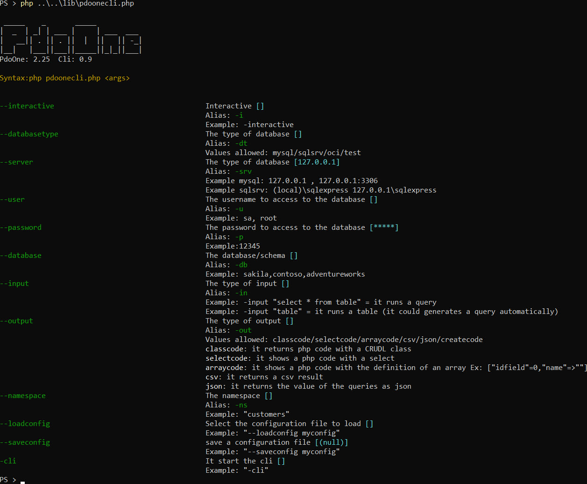
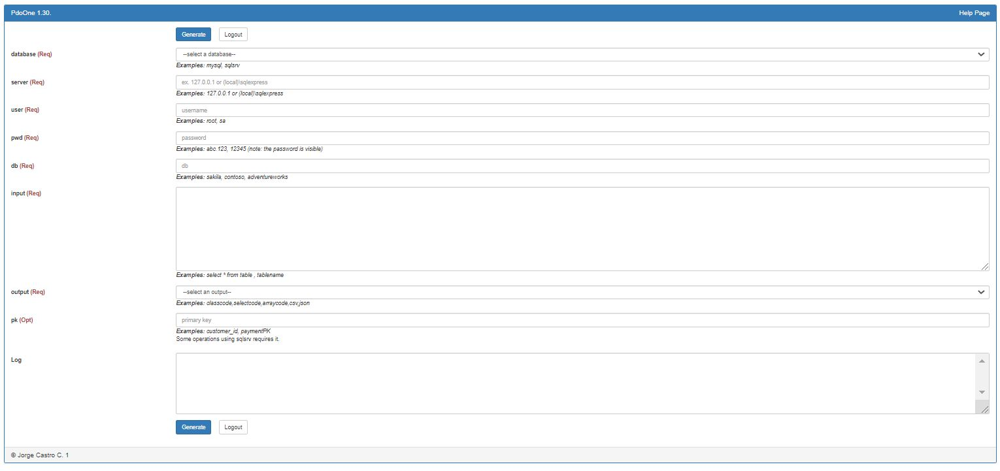

# Database Access Object wrapper for PHP and PDO in a single class

PdoOne. It's a simple wrapper for PHP's PDO library.

This library tries to work as fast as possible. Most of the operations are simple string/array managements and work in the bare metal of the PDO library.


[](https://packagist.org/packages/eftec/PdoOne)
[](https://packagist.org/packages/eftec/PdoOne)
[]()
[]()
[]()
[]()
[]()

Turn this 

```php
$stmt = $pdo->prepare("SELECT * FROM myTable WHERE name = ?");
$stmt->bindParam(1,$_POST['name'],PDO::PARAM_STR);
$stmt->execute();
$result = $stmt->get_result();
$products=[];
while($row = $result->fetch_assoc()) {
  $product[]=$row; 
}
$stmt->close();
```

into this

```php
$products=$pdoOne
    ->select("*")
    ->from("myTable")
    ->where("name = ?",['s',$_POST['name']]) // 's' = string/float/date, 'i'=integer, 'b'=boolean
    ->toList();
```

or using the generation of class.

```php
ProductRepo // this class was generated with echo $pdoOne()->generateCodeClass(['Product']);
    ::where("name = ?",['s',$_POST['name']])
    ::toList();
```


## Table of Content

- [Database Access Object wrapper for PHP and PDO in a single class](#database-access-object-wrapper-for-php-and-pdo-in-a-single-class)
  * [Install (using composer)](#install--using-composer-)
  * [Install (manually)](#install--manually-)
  * [Usage](#usage)
    + [Start a connection](#start-a-connection)
    + [Run an unprepared query](#run-an-unprepared-query)
    + [Run a prepared query](#run-a-prepared-query)
    + [Run a prepared query with parameters.](#run-a-prepared-query-with-parameters)
    + [Return data (first method)](#return-data--first-method-)
    + [Return data (second method)](#return-data--second-method-)
    + [Running a transaction](#running-a-transaction)
      - [startTransaction()](#starttransaction--)
      - [commit($throw=true)](#commit--throw-true-)
      - [rollback($throw=true)](#rollback--throw-true-)
    + [Fields](#fields)
    + [throwOnError=true](#throwonerror-true)
    + [isOpen=true](#isopen-true)
  * [Custom Queries](#custom-queries)
    + [tableExist($tableName)](#tableexist--tablename-)
    + [statValue($tableName,$columnName)](#statvalue--tablename--columnname-)
    + [columnTable($tablename)](#columntable--tablename-)
    + [foreignKeyTable($tableName)](#foreignkeytable--tablename-)
    + [createTable($tableName,$definition,$primaryKey=null,$extra='')](#createtable--tablename--definition--primarykey-null--extra----)
  * [Query Builder (DQL)](#query-builder--dql-)
    + [select($columns)](#select--columns-)
    + [count($sql,$arg='*')](#count--sql--arg-----)
    + [min($sql,$arg='*')](#min--sql--arg-----)
    + [max($sql,$arg='*')](#max--sql--arg-----)
    + [sum($sql,$arg='*')](#sum--sql--arg-----)
    + [avg($sql,$arg='*')](#avg--sql--arg-----)
    + [distinct($distinct='distinct')](#distinct--distinct--distinct--)
    + [from($tables)](#from--tables-)
    + [where($where,[$arrayParameters=array()])](#where--where---arrayparameters-array----)
    + [order($order)](#order--order-)
    + [group($group)](#group--group-)
    + [having($having,[$arrayParameters])](#having--having---arrayparameters--)
    + [runGen($returnArray=true)](#rungen--returnarray-true-)
    + [toList($pdoMode)](#tolist--pdomode-)
    + [toMeta()](#tometa--)
    + [toListSimple()](#tolistsimple--)
    + [toResult()](#toresult--)
    + [firstScalar($colName=null)](#firstscalar--colname-null-)
    + [first()](#first--)
    + [last()](#last--)
    + [sqlGen()](#sqlgen--)
  * [Query Builder (DML), i.e. insert, update,delete](#query-builder--dml---ie-insert--update-delete)
    + [insert($table,$schema,[$values])](#insert--table--schema---values--)
    + [insertObject($table,[$declarativeArray],$excludeColumn=[])](#insertobject--table---declarativearray---excludecolumn----)
    + [update($$table,$schema,$values,[$schemaWhere],[$valuesWhere])](#update---table--schema--values---schemawhere----valueswhere--)
    + [delete([$table],[$schemaWhere],[$valuesWhere])](#delete---table----schemawhere----valueswhere--)
  * [Sequence](#sequence)
    + [Creating a sequence](#creating-a-sequence)
    + [Using the sequence](#using-the-sequence)
    + [Creating a sequence without a table.](#creating-a-sequence-without-a-table)
    + [Benchmark (mysql, estimated)](#benchmark--mysql--estimated-)
  * [Changelist](#changelist)

## Examples

## Some example
| [ExampleTicketPHP](https://github.com/jorgecc/ExampleTicketPHP) | [Example cupcakes](https://github.com/EFTEC/example.cupcakes) | [Example Search](https://github.com/EFTEC/example-search)    |
| ------------------------------------------------------------ | ------------------------------------------------------------ | ------------------------------------------------------------ |
|  |  |  |


## Install (using composer)

>

Add to composer.json the next requirement, then update composer.

```json
  {
      "require": {
        "eftec/PdoOne": "^1.6"
      }
  }
```
or install it via cli using

> composer require eftec/PdoOne

## Install (manually)

Just download the file lib/PdoOne.php and save it in a folder.

## Usage

### Start a connection

```php
// mysql
$dao=new PdoOne("mysql","127.0.0.1","root","abc.123","sakila","");
$dao->connect();
// sql server
$dao=new PdoOne("sqlsrv","(local)\sqlexpress","sa","abc.123","sakila","");
$dao->connect();
```

where 
* "mysql" is the mysql database. It also allows sqlsrv (for sql server)
* 127.0.0.1 is the server where is the database.
* root is the user   
* abc.123 is the password of the user root.
* sakila is the database used.
* "" (optional) it could be a log file, such as c:\temp\log.txt

### Run an unprepared query

```php
$sql='CREATE TABLE `product` (
    `idproduct` INT NOT NULL AUTO_INCREMENT,
    `name` VARCHAR(45) NULL,
    PRIMARY KEY (`idproduct`));';
$pdoOne->runRawQuery($sql);  
```

### Run a query using a Prepared Statement of PDO
```php
$sql="insert into `product`(name) values(?)";
$stmt=$pdoOne->prepare($sql);
$productName="Cocacola";
$stmt->bind_param("s",$productName); // s stand for string. Also i =integer, d = double and b=blob
$pdoOne->runQuery($stmt);
```

> note: you could also insert using a procedural chain [insert($table,$schema,[$values])](#insert--table--schema---values--)

### Run a prepared query with parameters.
```php
// native query
$pdoOne->runRawQuery('insert into `product` (name) values(?)'
    ,array('s','cocacola'));
// query builder
$pdoOne->set(['name'=>'cocacola'])
    ->from('product')
    ->insert();

```


### Return data (first method)
It returns a PDOStatement.

```php
    $sql="select * from `product` order by name";
    $stmt=$pdoOne->prepare($sql);
    $pdoOne->runQuery($stmt);
    $rows = $stmt->get_result();
    while ($row = $rows->fetch_assoc()) {
        var_dump($row);
    }
    
```
> This statement must be processed manually.

### Return data (second method)
It returns an associative array.

```php
    $sql="select * from `product` order by name";
    $stmt=$pdoOne->prepare($sql);
    $pdoOne->runQuery($stmt);
    $rows = $stmt->get_result();
    $allRows=$rows->fetch_all(PDO::FETCH_ASSOC);
    var_dump($allRows);
```

### Running a transaction
```php
try {
    $sql="insert into `product`(name) values(?)";
    $pdoOne->startTransaction();
    $stmt=$pdoOne->prepare($sql);
    $productName="Fanta";
    $stmt->bind_param("s",$productName); 
    $pdoOne->runQuery($stmt);
    $pdoOne->commit(); // transaction ok
} catch (Exception $e) {
    $pdoOne->rollback(false); // error, transaction cancelled.
}
```
#### startTransaction()
It starts a transaction

#### commit($throw=true)
It commits a transaction. 
* If $throw is true then it throws an exception if the transaction fails to commit.  Otherwise, it does not.

#### rollback($throw=true)
It rollbacks a transaction. 
* If $throw is true then it throws an exception if the transaction fails to rollback.  If false, then it ignores if the rollback fail or if the transaction is not open.

### Recursive array

A recursive array is a array of  strings with values that it could be read or obtained or compared.  For example, to join a table conditionally.
PdoOne does not use it directly but _BasePdoOneRepo uses it (_BasePdoOneRepo is a class used when we generate a repository service class automatically).

> 

Example

```php
$this->select('*')->from('table')->recursive(['table1','table1.table2']);
// some operations that involves recursive
if($this->hasRecursive('table1')) {
    $this->innerJoin('table1 on table.c=table1.c');
}
if($this->hasRecursive('table1.table2')) {
    $this->innerJoin('table1 on table1.c=table2.c');
}
$r=$this->toList(); // recursive is resetted.
```

#### recursive()
It sets a recursive array.  

> This value is resets each time a chain methods ends.   

#### getRecursive()
It gets the recursive array.   

#### hasRecursive()
It returns true if recursive has some needle.  

If $this->recursive is ['*'] then it always returns true.

```php
$this->select('*')->from('table')->recursive(['*']);
$this->hasRecursive('anything'); // it always returns true.
```


### Fields

### throwOnError=true
If true (default), then it throws an error if happens an error. If false, then the execution continues  

### isOpen=true
It is true if the database is connected otherwise,it's false.


## Custom Queries

### tableExist($tableName)

Returns true if the table exists (current database/schema)

### statValue($tableName,$columnName)

Returns the stastictic (as an array) of a column of a table. 

```php
$stats=$pdoOne->statValue('actor','actor_id');
```

| min | max | avg      | sum   | count |
|-----|-----|----------|-------|-------|
| 1   | 205 | 103.0000 | 21115 | 205   |

### columnTable($tablename)

Returns all columns of a table

```php
$result=$pdoOne->columnTable('actor');
```

| colname     | coltype   | colsize | colpres | colscale | iskey | isidentity |
|-------------|-----------|---------|---------|----------|-------|------------|
| actor_id    | smallint  |         | 5       | 0        | 1     | 1          |
| first_name  | varchar   | 45      |         |          | 0     | 0          |
| last_name   | varchar   | 45      |         |          | 0     | 0          |
| last_update | timestamp |         |         |          | 0     | 0          |

### foreignKeyTable($tableName)

Returns all foreign keys of a table (source table)

### createTable($tableName,$definition,$primaryKey=null,$extra='',$extraOutside='')

Creates a table using a definition and primary key.

* **$definition** The definition is an associative array with the name of the column as key and the definition as value.
* **primaryKey** It could be an string or associative array.   
   * if it is an string then it is the name of the primary key, example "user_id";
   * it it is an associative array, then it could be used to define primary key, unique, key and foreign keys:
        * 'key_name'=>'PRIMARY KEY'
        * 'key_name'=>'KEY'
        * 'key_name'=>'UNIQUE KEY'
        * 'key_name'=>'FOREIGN KEY REFERENCES TABLEREF(COLREF) ...'
* **$extra** It defines a extra definition inside the definition of the table.
* **extraOutside** It defines a extra definition after the definition of the table.

>Note: You could generate a code to create a table using an existing table by executing cli (output classcode)   
> php pdoone.php -database mysql -server 127.0.0.1 -user root -pwd abc.123 -db sakila -input film -output classcode   

Example: (mysql)

```php
$pdo->createTable('film',                                                                                                
    [                                                                                                                    
        "film_id" => "smallint unsigned not null auto_increment",                                                        
        "title" => "varchar(255) not null",                                                                              
        "description" => "text",                                                                                         
        "release_year" => "year",                                                                                        
        "language_id" => "tinyint unsigned not null",                                                                    
        "original_language_id" => "tinyint unsigned",                                                                    
        "rental_duration" => "tinyint unsigned not null default '3'",                                                    
        "rental_rate" => "decimal(4,2) not null default '4.99'",                                                         
        "length" => "smallint unsigned",                                                                                 
        "replacement_cost" => "decimal(5,2) not null default '19.99'",                                                   
        "rating" => "enum('G','PG','PG-13','R','NC-17') default 'G'",                                                    
        "special_features" => "set('Trailers','Commentaries','Deleted Scenes','Behind the Scenes')",                     
        "last_update" => "timestamp not null default CURRENT_TIMESTAMP on update CURRENT_TIMESTAMP"                      
    ],[                                                                                                                  
        "film_id" => "PRIMARY KEY",                                                                                      
        "title" => "KEY",                                                                                                
        "language_id" => "FOREIGN KEY REFERENCES`language`(`language_id`) ON UPDATE CASCADE",                            
        "original_language_id" => "FOREIGN KEY REFERENCES`language`(`language_id`) ON UPDATE CASCADE"                    
    ]);                                                                                                                  
```

```php
$pdo->createTable('film',                                                                                                
    [                                                                                                                    
        "film_id" => "smallint unsigned not null auto_increment",                                                        
        "title" => "varchar(255) not null",                                                                              
        "description" => "text",                                                                                         
        "release_year" => "year",                                                                                        
        "language_id" => "tinyint unsigned not null",                                                                    
        "original_language_id" => "tinyint unsigned",                                                                    
        "rental_duration" => "tinyint unsigned not null default '3'",                                                    
        "rental_rate" => "decimal(4,2) not null default '4.99'",                                                         
        "length" => "smallint unsigned",                                                                                 
        "replacement_cost" => "decimal(5,2) not null default '19.99'",                                                   
        "rating" => "enum('G','PG','PG-13','R','NC-17') default 'G'",                                                    
        "special_features" => "set('Trailers','Commentaries','Deleted Scenes','Behind the Scenes')",                     
        "last_update" => "timestamp not null default CURRENT_TIMESTAMP on update CURRENT_TIMESTAMP"                      
    ],'film_id');                                                                                                                  
```

Example (sqlsrv)


```php
$pdo->createTable('film',
	[
	    "film_id" => "int NOT NULL IDENTITY(1,1)",
	    "title" => "varchar(255) NOT NULL",
	    "description" => "text(2147483647) DEFAULT (NULL)",
	    "release_year" => "varchar(4)",
	    "language_id" => "tinyint NOT NULL",
	    "original_language_id" => "tinyint DEFAULT (NULL)",
	    "rental_duration" => "tinyint NOT NULL DEFAULT ((3))",
	    "rental_rate" => "decimal(4,2) NOT NULL DEFAULT ((4.99))",
	    "length" => "smallint DEFAULT (NULL)",
	    "replacement_cost" => "decimal(5,2) NOT NULL DEFAULT ((19.99))",
	    "rating" => "varchar(10) DEFAULT ('G')",
	    "special_features" => "varchar(255) DEFAULT (NULL)",
	    "last_update" => "datetime NOT NULL DEFAULT (getdate())"
	],[
	    "language_id" => "FOREIGN KEY REFERENCES language(language_id)",
	    "original_language_id" => "FOREIGN KEY REFERENCES language(language_id)",
	    "film_id" => "PRIMARY KEY"
	]);
```

### tableSorted($maxLoop = 5, $returnProblems = false, $debugTrace = false)

It returns a list of tables ordered by dependency (from no dependent to more dependent)

**Note**: This operation is not foolproof because the tables could have circular references.

```php
$dao = new PdoOne('sqlsrv', "(local)\sqlexpress", "sa", "abc.123", "sakila");
$dao->open();
echo "<pre>";
var_dump($dao->tableSorted(3, false, true)); // it returns the tables sortered
var_dump($dao->tableSorted(3, true, true)); // it returns all the tables that can't be sortered
echo "</pre>";
```


### validateDefTable($pdoInstance,$tablename,$defTable,$defTableKey)

It validates a table if the table matches the definition asigned by values.

```
$def=[
	    "film_id" => "int NOT NULL IDENTITY(1,1)",
	    "title" => "varchar(255) NOT NULL",
	    "description" => "text(2147483647) DEFAULT (NULL)",
	    "release_year" => "varchar(4)",
	    "language_id" => "tinyint NOT NULL",
	    "original_language_id" => "tinyint DEFAULT (NULL)",
	    "rental_duration" => "tinyint NOT NULL DEFAULT ((3))",
	    "rental_rate" => "decimal(4,2) NOT NULL DEFAULT ((4.99))",
	    "length" => "smallint DEFAULT (NULL)",
	    "replacement_cost" => "decimal(5,2) NOT NULL DEFAULT ((19.99))",
	    "rating" => "varchar(10) DEFAULT ('G')",
	    "special_features" => "varchar(255) DEFAULT (NULL)",
	    "last_update" => "datetime NOT NULL DEFAULT (getdate())"
	];
$keys=[
	    "language_id" => "FOREIGN KEY REFERENCES language(language_id)",
	    "original_language_id" => "FOREIGN KEY REFERENCES language(language_id)",
	    "film_id" => "PRIMARY KEY"
	];	
	
var_dump(PdoOne::validateDefTable(self::getPdoOne(),self::TABLE,$def,$keys));
```


### foreignKeyTable

It returns all the foreign keys of a table.


```php

$result=$pdoOne->foreignKeyTable('actor');
```

| collocal    | tablerem | colrem      |
|-------------|----------|-------------|
| customer_id | customer | customer_id |
| rental_id   | rental   | rental_id   |
| staff_id    | staff    | staff_id    |


## Query Builder (DQL)
You could also build a procedural query.

Example:
```php
$results = $pdoOne->select("*")->from("producttype")
    ->where('name=?', ['s', 'Cocacola'])
    ->where('idproducttype=?', ['i', 1])
    ->toList();   
```

### select($columns)
Generates a select command.
```php
$results = $pdoOne->select("col1,col2"); //...
```
> Generates the query: **select col1,col2** ....

```php
$results = $pdoOne->select("select * from table"); //->...
```

> Generates the query: **select * from table** ....

### count($sql,$arg='*') 

Generates a query that returns a count of values.
It is a macro of the method select()

```php
$result = $pdoOne->count('from table where condition=1')->firstScalar(); // select count(*) from table where c..
$result = $pdoOne->count('from table','col1')->firstScalar(); // select count(col1) from table
```

### min($sql,$arg='*') 

Generates a query that returns the minimum value of a column.
If $arg is empty then it uses $sql for the name of the column
It is a macro of the method select()

```php
$result = $pdoOne->min('from table where condition=1','col')->firstScalar(); // select min(col) from table where c..
$result = $pdoOne->min('from table','col1')->firstScalar(); // select min(col1) from table
$result = $pdoOne->min('','col1')->from('table')->firstScalar(); // select min(col1) from table
$result = $pdoOne->min('col1')->from('table')->firstScalar(); // select min(col1) from table
```

### max($sql,$arg='*') 

Generates a query that returns the maximum value of a column.
If $arg is empty then it uses $sql for the name of the column
It is a macro of the method select()

```php
$result = $pdoOne->max('from table where condition=1','col')->firstScalar(); // select max(col) from table where c..
$result = $pdoOne->max('from table','col1')->firstScalar(); // select max(col1) from table
```

### sum($sql,$arg='*') 

Generates a query that returns the sum value of a column.
If $arg is empty then it uses $sql for the name of the column
It is a macro of the method select()

```php
$result = $pdoOne->sum('from table where condition=1','col')->firstScalar(); // select sum(col) from table where c..
$result = $pdoOne->sum('from table','col1')->firstScalar(); // select sum(col1) from table
```

### avg($sql,$arg='*') 

Generates a query that returns the average value of a column.
If $arg is empty then it uses $sql for the name of the column
It is a macro of the method select()

```php
$result = $pdoOne->avg('from table where condition=1','col')->firstScalar(); // select avg(col) from table where c..
$result = $pdoOne->avg('from table','col1')->firstScalar(); // select avg(col1) from table
```

### distinct($distinct='distinct')
Generates a select command.
```php
$results = $pdoOne->select("col1,col2")->distinct(); //...
```
> Generates the query: select **distinct** col1,col2 ....

>Note: ->distinct('unique') returns select **unique** ..

### from($tables)
Generates a "from" sql command.
```php
$results = $pdoOne->select("*")->from('table'); //...
```
> Generates the query: select * **from table**

**$tables** could be a single table or a sql construction. For examp, the next command is valid:

```php
$results = $pdoOne->select("*")->from('table t1 inner join t2 on t1.c1=t2.c2'); //...
```

### where($where,[$arrayParameters=array()])

Generates a where command.

* $where is an array or a string. If it's a string, then it's evaluated by using the parameters. if any

```php
$results = $pdoOne->select("*")
->from('table')
->where('p1=1'); //...
```

The where could be expressed in different ways.

#### 1) Where without parameters.

It is possible to write the where without parameters as follow:

```php
$results = $pdoOne->select("*")->from('table')->where("p1=1 and p2>2.5 or p3 like '%aa%'");
```

#### 2) Where with parameters defined by a indexed array.

```php
$aa='aa';
$results = $pdoOne->select("*")->from('table')->where("p1=? and p2>? or p3 like ?",['i',1
                                                                                    ,'s',2.5
                                                                                    ,'s',"%$aa%"]);
```

It also works 

```php
// (if there is only a single argument without a type)
$results = $pdoOne->select("*")->from('table')->where("p1=?",[1]);  // = where("p1=?",['i',1]);
// (if we don't define to where to put the value)
$results = $pdoOne->select("*")->from('table')->where("p1",[1]); // = where("p1=?",['i',1]);
```


#### 3) Where using an associative array

It is a shorthand definition of a query using an associative array, where the key is the name of the column and the value is the value to compare

It only works with **equality** (=) and the logic operator **'and'**  (the type is defined automatically)

```php
// select * from table where p1='1' and p2='2.5' and p3='aa'
$results = $pdoOne->select("*")->from('table')->where(['p1'=>1
                                                       ,'p2'=>2.5
                                                       ,'p3'=>'aa']);  
```

Also it is possible to specify the type of parameter.

```php
// select * from table where p1=1 and p2='2.5' and p3='aa'
$results = $pdoOne->select("*")->from('table')->where(['p1'=>['i',1]
                                                       ,'p2'=>['s',2.5]
                                                       ,'p3'=>['s','aa']]);  
```

#### 4) Using an associative array and named arguments

You could also use an associative array as argument and named parameters in the query

```php
$results = $pdoOne->select("*")->from("table")
    ->where('condition=:p1 and condition2=:p2',['p1'=>'Coca-Cola','p2'=>1])
    ->toList();
```

> Generates the query: select * from table **where condition=?(Coca-Cola) and condition2=?(1)**        


#### 5) Examples of where()

> Generates the query: select * **from table** where p1=1

> Note: ArrayParameters is an array as follow: **type,value.**     
>   Where type is i=integer, d=double, s=string or b=blob. In case of doubt, use "s" (see table bellow)   
> Example of arrayParameters:   
> ['i',1 ,'s','hello' ,'d',20.3 ,'s','world']

```php
$results = $pdoOne->select("*")
->from('table')
->where('p1=?',['i',1]); //...
```
> Generates the query: select * from table **where p1=?(1)**

```php
$results = $pdoOne->select("*")
->from('table')
->where('p1=? and p2=?',['i',1,'s','hello']); //...
```

> Generates the query: select * from table **where p1=?(1) and p2=?('hello')**

> Note. where could be nested.
```php
$results = $pdoOne->select("*")
->from('table')
->where('p1=?',['i',1])
->where('p2=?',['s','hello']); //...
```
> Generates the query: select * from table **where p1=?(1) and p2=?('hello')**

You could also use:
```php
$results = $pdoOne->select("*")->from("table")
    ->where(['p1'=>'Coca-Cola','p2'=>1])
    ->toList();
```
> Generates the query: select * from table **where p1=?(Coca-Cola) and p2=?(1)**        


#### Types of Parameters

| ParameterName | Description                                                 | Example                                     |
| ------------- | ----------------------------------------------------------- | ------------------------------------------- |
| "i"           | Integer parameter (equals to PDO::PARAM_INT)                | ("i",200)                                   |
| "s"           | String, Float and Date parameter (equals to PDO::PARAM_STR) | ("s","hello","s",20.5,"s","2020/01/01")     |
| "b"           | Boolean parameter (equals to PDO::PARAM_BOL)                | ("b",false)                                 |
| PDO::PARAM_*  | Parameter defined using the values of PDO                   | (PDO::PARAM_INT,200,PDO::PARAM_STR,"hello") |


### order($order)
Generates a order command.
```php
$results = $pdoOne->select("*")
->from('table')
->order('p1 desc'); //...
```
> Generates the query: select * from table **order by p1 desc**

### group($group)
Generates a group command.
```php
$results = $pdoOne->select("*")
->from('table')
->group('p1'); //...
```
> Generates the query: select * from table **group by p1**

### having($having,[$arrayParameters])
Generates a group command.
```php
$results = $pdoOne->select("*")
->from('table')
->group('p1')
->having('p1>?',array('i',1)); //...
```
> Generates the query: select * from table group by p1 having p1>?(1)

> Note: Having could be nested having()->having()  
> Note: Having could be without parameters having('col>10') 

### runGen($returnArray=true)
Run the query generate.

>Note if returnArray is true then it returns an associative array.
> if returnArray is false then it returns a mysqli_result  
>Note: It resets the current parameters (such as current select, from, where,etc.)

### toList($pdoMode)
It's a macro of runGen. It returns an associative array or null.

```php
$results = $pdoOne->select("*")
->from('table')
->toList(); 
```

### toMeta()
It returns a metacode of each columns of the query.

```php
$results = $pdoOne->select("*")
->from('table')
->toMeta(); 
```

or

```php
$results = $pdoOne->toMeta('select * from table'); 
```

result:

```
array(3) {
  [0]=>
  array(7) {
    ["native_type"]=>
    string(4) "LONG"
    ["pdo_type"]=>
    int(2)
    ["flags"]=>
    array(2) {
      [0]=>
      string(8) "not_null"
      [1]=>
      string(11) "primary_key"
    }
    ["table"]=>
    string(11) "producttype"
    ["name"]=>
    string(13) "idproducttype"
    ["len"]=>
    int(11)
    ["precision"]=>
    int(0)
  }
  [1]=>
  array(7) {
    ["native_type"]=>
    string(10) "VAR_STRING"
    ["pdo_type"]=>
    int(2)
    ["flags"]=>
    array(0) {
    }
    ["table"]=>
    string(11) "producttype"
    ["name"]=>
    string(4) "name"
    ["len"]=>
    int(135)
    ["precision"]=>
    int(0)
  }
}
```

### toListSimple()
It's a macro of runGen. It returns an indexed array from the first column

```php
$results = $pdoOne->select("*")
->from('table')
->toListSimple(); // ['1','2','3','4']
```
### toListKeyValue()
It returns an associative array where the first value is the key and the second is the value.  
If the second value does not exist then it uses the index as value (first value).  

```php
$results = $pdoOne->select("cod,name")
->from('table')
->toListKeyValue(); // ['cod1'=>'name1','cod2'=>'name2']
```


### toResult()
It's a macro of runGen. It returns a mysqli_result or null.

```php
$results = $pdoOne->select("*")
->from('table')
->toResult(); //
```

### firstScalar($colName=null)

It returns the first scalar (one value) of a query. 
If $colName is null then it uses the first column.

```php
$count=$this->pdoOne->count('from product_category')->firstScalar();
```

### first()
It's a macro of runGen. It returns the first row if any, if not then it returns false, as an associative array.

```php
$results = $pdoOne->select("*")
->from('table')
->first(); 
```

### last()
It's a macro of runGen. It returns the last row (if any, if not, it returns false) as an associative array.

```php
$results = $pdoOne->select("*")
->from('table')
->last(); 
```
> Sometimes is more efficient to run order() and first() because last() reads all values.

### sqlGen()

It returns the sql command.
```php
$sql = $pdoOne->select("*")
->from('table')
->sqlGen();
echo $sql; // returns select * from table
$results=$pdoOne->toList(); // executes the query
```
> Note: it doesn't reset the query.

## Query Builder (DML), i.e. insert, update,delete

There are four ways to execute each command.

Let's say that we want to add an **integer** in the column **col1** with the value **20**

__Schema and values using a list of values__: Where the first value is the column, the second is the type of value (i=integer,d=double,s=string,b=blob) and second array contains the values.
```php
$pdoOne->insert("table"
    ,['col1','i']
    ,[20]);
```
__Schema and values in the same list__: Where the first value is the column, the second is the type of value (i=integer,d=double,s=string,b=blob) and the third is the value.
```php
$pdoOne->insert("table"
    ,['col1','i',20]);
```

__Schema and values using two associative arrays__:

```php
$pdoOne->insert("table"
    ,['col1'=>'i']
    ,['col1'=>20]);
```
__Schema and values using a single associative array__: The type is calculated automatically.

```php
$pdoOne->insert("table"
    ,['col1'=>20]);
```

### insert($table,$schema,[$values])
Generates a insert command.

```php
$pdoOne->insert("producttype"
    ,['idproducttype','i','name','s','type','i']
    ,[1,'cocacola',1]);
```

Using nested chain (single array)
```php
    $pdoOne->from("producttype")
        ->set(['idproducttype','i',0 ,'name','s','Pepsi' ,'type','i',1])
        ->insert();
```

Using nested chain multiple set
```php
    $pdoOne->from("producttype")
        ->set("idproducttype=?",['i',101])
        ->set('name=?',['s','Pepsi'])
        ->set('type=?',['i',1])
        ->insert();
```
or (the type is defined, in the possible, automatically by MySql)     
```php
    $pdoOne->from("producttype")
        ->set("idproducttype=?",['i',101])
        ->set('name=?','Pepsi')
        ->set('type=?',1)
        ->insert();
```

### insertObject($table,[$declarativeArray],$excludeColumn=[])
```php
    $pdoOne->insertObject('table',['Id'=>1,'Name'=>'CocaCola']);
```


Using nested chain declarative set
```php
    $pdoOne->from("producttype")
        ->set('(idproducttype,name,type) values (?,?,?)',['i',100,'s','Pepsi','i',1])
        ->insert();
```


> Generates the query: **insert into productype(idproducttype,name,type) values(?,?,?)** ....


### update($$table,$schema,$values,[$schemaWhere],[$valuesWhere])
Generates a insert command.

```php
$pdoOne->update("producttype"
    ,['name','s','type','i'] //set
    ,[6,'Captain-Crunch',2] //set
    ,['idproducttype','i'] // where
    ,[6]); // where
```

```php
$pdoOne->update("producttype"
    ,['name'=>'Captain-Crunch','type'=>2] // set
    ,['idproducttype'=>6]); // where
```

```php
$pdoOne->from("producttype")
    ->set("name=?",['s','Captain-Crunch']) //set
    ->set("type=?",['i',6]) //set
    ->where('idproducttype=?',['i',6]) // where
    ->update(); // update
```

or

```php
$pdoOne->from("producttype")
    ->set("name=?",'Captain-Crunch') //set
    ->set("type=?",6) //set
    ->where('idproducttype=?',['i',6]) // where
    ->update(); // update
```


> Generates the query: **update producttype set `name`=?,`type`=? where `idproducttype`=?** ....

### delete([$table],[$schemaWhere],[$valuesWhere])
Generates a delete command.

```php
$pdoOne->delete("producttype"
    ,['idproducttype','i'] // where
    ,[7]); // where
```
```php
$pdoOne->delete("producttype"
    ,['idproducttype'=>7]); // where
```
> Generates the query: **delete from producttype where `idproducttype`=?** ....

You could also delete via a DQL builder chain.
```php
$pdoOne->from("producttype")
    ->where('idproducttype=?',['i',7]) // where
    ->delete(); 
```
```php
$pdoOne->from("producttype")
    ->where(['idproducttype'=>7]) // where
    ->delete(); 
```
> Generates the query: **delete from producttype where `idproducttype`=?** ....


## Cache

It is possible to optionally cache the result of the queries. The duration of the query is also defined in the query.
If the result of the query is not cached, then it is calculated normally (executing the query in the database.   For 
identify a query as unique, the system generates an unique id (uid) based in sha256 created with the query, 
parameters, methods and the type of operation.

The library does not do any cache operation directly, instead it allows to cache the results using an external library.

* Cache works with the next methods.
    * toList()
    * toListSimple()
    * first()
    * firstScalar()
    * last()
    
### How it works

(1) We need to define a class that implements \eftec\IPdoOneCache

```php
class CacheService implements \eftec\IPdoOneCache {
    public $cacheData=[];
    public $cacheCounter=0; // for debug
    public  function getCache($uid,$family='') {
        if(isset($this->cacheData[$uid])) {
            $this->cacheCounter++;
            echo "using cache\n";
            return $this->cacheData[$uid];
        }
        return false;
    }
    public function setCache($uid,$family='',$data=null,$ttl=null) {
        
        $this->cacheData[$uid]=$data;
    }
    public function invalidateCache($uid = '', $family = '') {
        unset($this->cacheData[$uid]);
    }
}
$cache=new CacheService();
```

(2) Sets the cache service

```php
    $pdoOne=new PdoOne("mysql","127.0.0.1","travis","","travisdb");
    $cache=new CacheService();
    $$pdoOne->setCacheService($cache);
```
(3) Use the cache as as follow, we must add the method useCache() in any part of the query.

```php
    $pdoOne->select('select * from table')
        ->useCache()->toList(); // cache that never expires
    $pdoOne->select('select * from table')
        ->useCache(1000)->toList(); // cache that lasts 1000ms.
```

### Example using apcu

```php
class CacheService implements \eftec\IPdoOneCache {
    public  function getCache($uid,$family='') {
        return apcu_fetch($uid);
    }
    public function setCache($uid,$family='',$data=null,$ttl=null) {
        apcu_store($uid,$data,$ttl);
    }
    public function invalidateCache($uid = '', $family = '') {
        // invalidate cache
        apcu_delete($uid);
    }
}
$cache=new CacheService();
```


## Sequence

Sequence is an alternative to AUTO_NUMERIC field.  It uses a table to generate an unique ID.  
The sequence used is based on Twitter's Snowflake and it is generated based on 
time (with microseconds), Node Id and a sequence.   This generates a LONG (int 64) value that it's unique

### Creating a sequence

* **$dao->nodeId** set the node value (default is 1). If we want unique values amongst different clusters,
 then we could set the value
of the node as unique. The limit is up to 1024 nodes.
* **$dao->tableSequence** it sets the table (and function), the default value is snowflake.

```
$dao->nodeId=1; // optional
$dao->tableSequence='snowflake'; // optional
$dao->createSequence(); // it creates a table called snowflake and a function called next_snowflake()
```

### Using the sequence

* **$dao->getSequence([unpredictable=false])** returns the last sequence. If the sequence fails to generate, then it returns -1.
 The function could fails if the function is called more than 4096 times every 1/1000th second.

```
$dao->getSequence() // string(19) "3639032938181434317" 
```

```
$dao->getSequence(true) // returns a sequence by flipping some values.
```

### Creating a sequence without a table.

* **$dao->getSequencePHP([unpredictable=false])** Returns a sequence without using a table.
  This sequence is more efficient than $dao->getSequence but it uses a random value to deals
  with collisions.
  
* If upredictable is true then it returns an unpredictable number (it flips some digits)

```
$dao->getSequencePHP() // string(19) "3639032938181434317" 
```

```
$dao->getSequencePHP(true) // string(19) "1739032938181434311" 
```

## CLI 

PdoOne has some features available only in CLI.  




```
 _____    _       _____
|  _  | _| | ___ |     | ___  ___
|   __|| . || . ||  |  ||   || -_|
|__|   |___||___||_____||_|_||___|  1.28.1

Syntax:php PdoOne.php <args>
-database [$database]
    Example: (mysql/sqlsrv/oracle/test)
-server [$server]
    Example mysql: 127.0.0.1 , 127.0.0.1:3306
    Example sqlsrv: (local)\sqlexpress 127.0.0.1\sqlexpress
-user The username to access to the database [$user]
    Example: root, su
-pwd The password to access to the database [***]
    Example: abc.123
-db The database/schema [$db]
    Example: sakila
-input The input value.[$input]
    Example: "select * from table" = it runs a query
    Example: "table" = it runs a table (it could generates a query automatically)
-output The result value. [$output]
    classcode: it returns php code with a CRUDL class
    selectcode: it shows a php code with a select
    arraycode: it shows a php code with the definition of an array Ex: ['idfield'=0,'name'=>'']
    csv: it returns a csv result
    json: it returns the value of the queries as json
-pk [optional] the primary key. It is requerido for SQLSERVER and output classcode [$pk]
    Example: "customerid"    

```


### Run as cli

Execute the next line (in the lib folder)

> php PdoOne.php <arg>

(or pointing to the right folder)

> php /var/web/vendor/eftec/lib/PdoOne.php <arg>

Note: It requires to enter all arguments (-database, -server, etc.)

### cli-classcode

The functionality will generate a ready-to-use repository class.

Let's say the next example

> mysql:  
> php pdoone.php -database mysql -server 127.0.0.1:3306 -user root -pwd abc.123 -db sakila -input "Actor" -output classcode  
> sqlsrv:  
> php pdoone.php -database sqlsrv -server PCJC\SQLEXPRESS -user sa -pwd abc.123 -db sakila -input "Actor" -output classcode  

It will connect to the database mysql, ip: 127.0.0.1 and database sakila, and it will read the "actor" table.


It will return the next result

```php
/**
 * Generated by PdoOne Version 1.28
 * Class ActorRepo
 */
class ActorRepo
{
    const TABLE = 'Actor';
    const PK = 'actor_id';
    /** @var PdoOne */
    public static $pdoOne = null;

    /**
     * It creates a new table<br>
     * If the table exists then the operation is ignored (and it returns false)
     *
     * @param array $definition
     * @param null  $extra
     *
     * @return array|bool|PDOStatement
     * @throws Exception
     */
    public static function createTable($definition, $extra = null) {
        if (!self::getPdoOne()->tableExist(self::TABLE)) {
            return self::getPdoOne()->createTable(self::TABLE, $definition, self::PK, $extra);
        }
        return false; // table already exist
    }
    // .....
}

```

This functionality will generate a new Repository class with the most common operations: insert, 
list, update, delete, get, count, create table, drop table and truncate table

Why we need to generate a class? (instead of inherit one)  This Crud class is only a starting point. The developer 
could modify the code, add new methods, modify previous method and so one.

For to use the class, we could write the next code:

```php
// 1) option 1, inject an instance of $pdo
ActorRepo::setPdoOne($pdoOne); // it inject the current connect to the database

// 2) option 2.
// If the global variable $pdoOne exists, then it is injected. (unless it is defined by using setPdoOne()
$pdoOne=new PdoOne("mysql","127.0.0.1","root","abc.123","sakila","");
$pdoOne->connect();

// 3) option 3
// If the global function pdoOne() exists, then it is used for obtain the instance.
function pdoOne() {
    global $pdo;
    if ($pdo===null) {
        $pdo=new PdoOne('mysql','127.0.0.1','root','abc.123','sakila');
    }
    return $pdo;
}


$actorActorRepo::get(2); // it will read the actor with the pk=2 and it will return as an array.
$actors=$actorArray=ActorRepo::select(); // it returns all the rows.

```

Alternatively, you could generate the php file automatically as follow:

> php pdoone.php -database mysql -server 127.0.0.1:3306 -user root -pwd abc.123 -db sakila
> -input "Actor" -output classcode >ActorRepo.php

Note: the code lacks of php-tags, namespace and use but everything else is here.


### cli-selectcode

It will take a query and will return a php code with the query formatted.

Example:

>  php pdoone.php -database mysql -server 127.0.0.1:3306 -user root -pwd abc.123 -db sakila
> -input "select * from actor" -output selectcode

It will generate the next code:

```php
 /** @var array $result=array(["actor_id"=>0,"first_name"=>'',"last_name"=>'',"last_update"=>'']) */
 $result=$pdo
         ->select("*")
         ->from("actor")
         ->toList();
```

### cli-arraycode

It will generate an associative array (with default values) based in the query or table selected.

>  php pdoone.php -database mysql -server 127.0.0.1:3306 -user root -pwd abc.123 -db sakila
> -input "select * from actor" -output arraycode

It will return:

```php
// ["actor_id"=>0,"first_name"=>'',"last_name"=>'',"last_update"=>'']
```

### cli-json

It will return the result of the query as a json

>  php pdoone.php -database mysql -server 127.0.0.1:3306 -user root -pwd abc.123 -db sakila
> -input "select * from actor" -output json

It will return:

```json
[{"actor_id":"1","first_name":"PENELOPE","last_name":"GUINESS","last_update":"2006-02-15 01:34:33"}
,{"actor_id":"2","first_name":"NICK","last_name":"WAHLBERG","last_update":"2006-02-15 01:34:33"}
,{"actor_id":"3","first_name":"ED","last_name":"CHASE","last_update":"2006-02-15 01:34:33"}
,{"actor_id":"4","first_name":"JENNIFER","last_name":"DAVIS","last_update"}]
```

### cli-csv

It will return the result of the query as a json

>  php pdoone.php -database mysql -server 127.0.0.1:3306 -user root -pwd abc.123 -db sakila
> -input "select * from actor" -output csv

It will return:

```csv
actor_id,first_name,last_name,last_update
1,"PENELOPE","GUINESS","2006-02-15 01:34:33"
2,"NICK","WAHLBERG","2006-02-15 01:34:33"
3,"ED","CHASE","2006-02-15 01:34:33"
4,"JENNIFER","DAVIS","2006-02-15 01:34:33"
```

### UI

Alternatively to the CLI, the library has an interface visual. It does all the operation of the CLI.



### How to run the UI?

Simply call the method render()

```php
<?php

use eftec\PdoOne;
use mapache_commons\Collection;

include "../vendor/autoload.php";

$dao=new PdoOne("test","127.0.0.1","dummy","dummy","dummy"); // we need any connection.
$dao->logLevel=3;

$dao->render();
```


> There is an example in the folder examples/testui.php


## Code generation.

There are several ways to generate a Repository code, it is possible to generate a code using the CLI, the GUI or using the next code:

```php
$pdo=new PdoOne('mysql','127.0.0.1','root','abc.123','sakila');
$pdo->connect();
$table=$pdo->generateCodeClass('Tablename','repo'); // where Tablename is the name of the table to analyze. it must exsits.
echo $clase;
```

The code generated looks like this one

```php
class TableNameRepo extends _BasePdoOneRepo
{
// ....
}
```

### Creating the repository class

There are several ways to create a class, you could use the UI, the CLI or directly via code.

It is an example to create our repository class

```php
$class = $pdoOne->generateCodeClass('Customer'); // The table Customer must exists in the database
file_put_contents('CustomerRepo.php',$clase); // and we write the code into a file.
```

It will build our Repository class.

```php
<?php
use eftec\PdoOne;
use eftec\_BasePdoOneRepo;

class CustomerRepo extends _BasePdoOneRepo
{
    //....
}
```


We could also specify the namespace

```php
$class = $pdoOne->generateCodeClass('Customer','namespace\anothernamespace'); 
```

It will generate the next class

```php
<?php
namespace namespace\anothernamespace    
use eftec\PdoOne;
use eftec\_BasePdoOneRepo;

class CustomerRepo extends _BasePdoOneRepo
{
    //....
}
```


### Using the Repository class.

For started, the library must know to know where to connect, so you must set an instance of the PdoOne and there are 3 ways to instance it.

You could do it by creating a function called **pdoOne()**

```php
function pdoOne() {
$pdo=new PdoOne('mysql','127.0.0.1','root','abc.123','sakila');
$pdo->connect();
}
```

Or creating a global variable called **$pdoOne**

```php
$pdoOne=new PdoOne('mysql','127.0.0.1','root','abc.123','sakila');
$pdoOne->connect();
```

Or injecting the instance into the class using the static method **Class::setPdoOne()**

```php
$pdo=new PdoOne('mysql','127.0.0.1','root','abc.123','sakila');
$pdo->connect();
TableNameRepo::setPdoOne($pdo);
```

### DDL  Database Design Language

```php
TablaParentRepo::createTable();
TablaParentRepo::createForeignKeys();
TablaParentRepo::dropTable();
TablaParentRepo::truncate();
// We don't have a method to alter a table.
$ok=TablaParentRepo::validTable(); // it returns true if the table matches with the definition stored into the clas
```

### DQL Database Query Language

```php
$data=TableNameRepo::toList(); // select * from tablerepo
$data=TableNameRepo::first($pk); // select * from tablerepo where pk=$pk (it always returns 1 or zero values)
$data=TableNameRepo::where('a1=?',['i',$value])::toList(); // select * from tablerepo where a1=$value 
$data=TableNameRepo::where('a1=?',['i',$value])::first(); // it returns the first value (or false if not found)
$data=TableNameRepo::exist($pk); // returns true if the object exists.
$data=TableNameRepo::count($conditions); 
$data=TableNameRepo::where('a1=?',['i',$value])::count();
```

### DML Database Model Language

```php
// where obj is an associative array, where the keys are the name of the columns (case sensitive)
$identity=TablaParentRepo::insert($obj); 
TablaParentRepo::update($obj);
TablaParentRepo::delete($obj);
TablaParentRepo::deleteById($obj);
```

### Nested Operators

```php
TablaParentRepo
    ::where() // where
    ::order() // order by
    ::group() // group by
    ::limit() // limit
    ::innerjoin() // inner join
    ::left() // left join
    ::right() // right join.
```


## Benchmark (mysql, estimated)

| Library                 | Insert | findPk | hydrate | with | time   |
|-------------------------|--------|--------|---------|------|--------|
| PDO                     | 671    | 60     | 278     | 887  | 3,74   |
| **PdoOne**              | 774    | 63     | 292     | 903  | 4,73   |
| LessQL                  | 1413   | 133    | 539     | 825  | 5,984  |
| YiiM                    | 2260   | 127    | 446     | 1516 | 8,415  |
| YiiMWithCache           | 1925   | 122    | 421     | 1547 | 7,854  |
| Yii2M                   | 4344   | 208    | 632     | 1165 | 11,968 |
| Yii2MArrayHydrate       | 4114   | 213    | 531     | 1073 | 11,22  |
| Yii2MScalarHydrate      | 4150   | 198    | 421     | 516  | 9,537  |
| Propel20                | 2507   | 123    | 1373    | 1960 | 11,781 |
| Propel20WithCache       | 1519   | 68     | 1045    | 1454 | 8,228  |
| Propel20FormatOnDemand  | 1501   | 72     | 994     | 1423 | 8,228  |
| DoctrineM               | 2119   | 250    | 1592    | 1258 | 18,139 |
| DoctrineMWithCache      | 2084   | 243    | 1634    | 1155 | 17,952 |
| DoctrineMArrayHydrate   | 2137   | 240    | 1230    | 877  | 16,83  |
| DoctrineMScalarHydrate  | 2084   | 392    | 1542    | 939  | 18,887 |
| DoctrineMWithoutProxies | 2119   | 252    | 1432    | 1960 | 19,822 |
| Eloquent                | 3691   | 228    | 708     | 1413 | 12,155 |

PdoOne adds a bit of ovehead over PDO, however it is simple a wrapper to pdo.

## Changelist

In a nutshell:

* Every major version means that it breaks something. I.e. 1.0 -> 2.0  
* Every minor version means that it adds a new functionality i.e. 1.5 -> 1.6 (new methods)  
* Every decimal version means that it patches/fixes/refactoring a previous functionality i.e. 1.5.0 -> 1.5.1 (fix)  

* 1.42 2020-5-29
  * Updated BasePdoOneRepo to 4.2. Now it works with cache
  * New method buildUniqueID()
* 1.41.2 2020-5-29
  * Updated BasePdoOneRepo to 4.1.1 In the method _first(), if argument is null then it doesn't query the value. 
* 1.41.1 2020-5-28
  * Added more phpdoc for generateCodeClass()         
* 1.41 2020-5-28
  * Updated BasePdoOneRepo to 4.0.1. It allows to specify a prefix in classes.
  * generateCodeClass() allows to specificy a prefix different from 'Repo'.
* 1.40.1 2020-5-27
  * Updated BasePdoOneRepo to 4.0.1 It allows long namespaces. It also adds an alias to the first table.   
* 1.40 2020-05-21
  * Updated BasePdoOneRepo 4.0
* 1.39 2020-05-12
  * Updated _BasePdoOneRepo to version 4.0      
  * Solved a problem with getDefTableFK (mysql and sqlsrv)   
  * new field (database_identityName)   
  * Solved a problem with getPK (sqlsrv)  

* 1.38 2020-05-10
  * updated _BasePdoOneRepo to version 4.0     

* 1.37 2020-05-03
  * added method setNoReset()

* 1.36 2020-05-03
    * added method hasRecursive()  
* 1.35.1 2020-04-30
    * autoload.php delete (it's a trash file)   
* 1.35 2020-04-28
    * _BasePdoOneRepo 2.3 added relation ONETOMANY
    * generateCodeClass() supports for _BasePdoOneRepo 2.3
* 1.34.2 2020-04-27
    * Updated other components.
    * left(), right() and innerjoin() don't replace where() anymore


* 1.34.1 2020-04-27
    * _BasePdoOneRepo 2.2.1 fixed.

* 1.34 2020-04-27
    * _BasePdoOneRepo 2.2 now it allows load relation many by one.   
    * sniffer is removed. Using Php Inspections ​(EA Extended)​   
* 1.33 2020-04-15   
    * _BasePdoOneRepo version 2.1     
    * new method hasWhere()    
    * generateCodeArray() has a new argument (recursive)  
    * toList(), first(), firstScalar(), toMeta(), toListSimple() and all related method throws error
    more close to the method.  
    * Travis has been removed (tests are done locally in my machine. Why? It's because travis is not fully compatible 
    with sqlsrv)  
* 1.32.1 BasePdoOneRepo added version 2.0
* 1.32 2020-04-12
    * The class generated now extends _BasePdoOneRepo  
        * It implements the default commands: insert,select,update,delete,create table,truncate.  
    * Security: user/password is deleted from memory after connection.
    * Mysql:createSequence() functions are now marked as "MODIFIES SQL DATA" and "NOT DETERMINISTIC"
    * Added more test, including test for SQLSRV.
* 1.31.1 2020-04-11
    * CLI: Primary key is not required anymore.
    * new method createFK();
    * Foreign keys are not created separately of other keys.
    * new method camelize()
    * new method isQuery()
    * new method filterKey()
    * new method getDefTableFK()
* 1.31 2020-04-11
    * new method tableSorted()
* 1.30 2020-04-10
    * Class separated in 3 new service class
    * lib/ext/PdoOne_Mysql.php = Service class for Mysql (mysql)
    * lib/ext/PdoOne_Sqlsrv.php = Service class for Sql Server (sqlsrv)
    * lib/ext/PdoOne_TestMockup.php = Service class for mockup test (test)
    * lib/ext/PdoOne_IExt.php = Interface for all services.
    * the /examples folder is not delivered by default. It allows to reduce the number of size.  Use composer --prefer-source to get the examples
* 1.29 2020-04-10
    * createTable() now allows more features
    * new method validateDefTable()
    * a new UI render() 
* 1.28.1 2020-04-06
    * cli now supports sqlsrv
* 1.28 2020-04-06
    * method toMeta() now allows arguments.
    * **The library now has a cli interface and a generation of code**
    * new method isCli()
    * new method cliEngine()
    * new method getParameterCli() protected
    * new method removeTrailSlash() protected
    * new method fixCsv() protected
    * new method generateCodeSelect() protected
    * new method generateCodeArray() protected
    * new method generateCodeClass() protected
* 1.24 2020-03-26
    * builderReset() is now public
* 1.23.1 2020-03-10
    * Fixed a problem with the cache
* 1.23 2020-03-10
    * method toMeta()
* 1.22 2020-02-08
    * method invalidateCache()
    * changed the interface IPdoOneCache
* 1.21 2020-02-07    
    * method setCacheService() and getCacheService()  
    * method useCache()  
* 1.20 2020-jan-25  
    * Many cleanups.  
    * update() and delete() now allows to set the query.   
    * new method addDelimiter() to add delimiters to the query (i.e. 'table' for mysql and [table] for sql server)   
* 1.19 2020-jan-15
    * getSequence() now has a new argument (name of the sequence, optional)
    * createSequence() has a new argument (type of sequence) and it allows to create a sequential sequence.
    * objectexist() now is public and it allows to works with functions
    * Bug fixed: objectExist() now works correctly (used by tableExist())
    * new DDL methods drop(), dropTable() and truncate()
* 1.16 2020-jan-14
    * new method toListKeyValue()
* 1.15 2019-dec-29
    * Fix small bug if the argument of isAssoc() is not an array.
* 1.14 2019-dec-26
    * method where() works with associative array
* 1.13 2019-dec-26 
    * new method count()
    * new method sum()
    * new method min()
    * new method max()
    * new method avg()
    * method select now allows null definition.
    * obtainSqlFields() discontinued
* 1.12 2019-oct-20 Added argument (optional) ->toList($pdomodel) Added method ->toListSimple()
* 1.11 2019-oct-01 1.11 It is still compatible with php 5.6.Added to composer.json
* 1.10 2019-oct-01 1.10 Added method dateConvert(). Added trace to the throw. 
* 1.9 2019-aug-10 1.8 republished
* 1.8 2019-aug-10 Added a date format. Methods dateSql2Text() and dateText2Sql()
* 1.7 2019-jun-23 Added some benchmark. It also solves a problem with the tags.  Now: table.field=? is converted to `table`.`field`=?  
* 1.6 2019-jun-22 affected_rows() returns a correct value. 
* 1.5 2019-may-31 some cleanups.  columnTable() returns if the column is nullable or not. 
* 1.4 2019-may-30 insertobject()
* 1.3 2019-may-23 New changes
* 1.2 2019-may-22 New fixed.
* 1.1 2019-may-21 Some maintenance
* 1.0 2019-may-21 First version 
